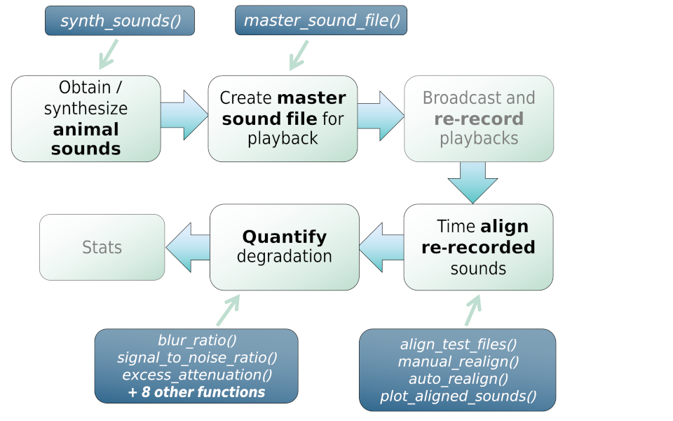

<!-- README.md is generated from README.Rmd. Please edit that file -->

<!-- badges: start -->
[](https://github.com/ropensci/software-review/issues/609)[](https://lifecycle.r-lib.org/articles/stages.html) [](https://cran.r-project.org/package=baRulho) [](https://www.repostatus.org/#active) 
[](https://www.gnu.org/licenses/gpl-3.0) [", "", grep("^DEPENDS", ignore.case = TRUE, readLines(con = "./DESCRIPTION"), value = TRUE), ignore.case = TRUE), ",")[[1]][1]`-6666ff.svg)](https://cran.r-project.org/)
[](https://cran.r-project.org/package=baRulho)
[](https://cran.r-project.org/package=baRulho)
[](https://app.codecov.io/gh/ropensci/baRulho?branch=master)
[](https://github.com/ropensci/baRulho/actions/workflows/R-CMD-check.yaml)
[](https://doi.org/10.1111/2041-210X.14481)
[](https://github.com/ropensci/baRulho/commits/master)
<!-- badges: end -->


[baRulho](https://cran.r-project.org/package=baRulho) is intended to facilitate the implementation of (animal) sound propagation experiments, which typically aim to quantify changes in signal structure when transmitted in a given habitat by broadcasting and re-recording animal sounds at increasing distances. 

These experiments aim to answer research questions such as:

- How has habitat structure shaped the propagation properties of animal acoustic signals?
- Which acoustic features have been shaped by selection for improved propagation?
- Which features degrade more in which habitats?
- How far can acoustic signals be detected?

A common sequence of steps to experimentally test hypotheses related to sound propagation is depicted in the following diagram:

```{r, echo=FALSE, out.width="100%", fig.align='center'}



```

_Diagram depicting a typical workflow for a experiment working on signal propagation and degradation. Nodes with black font indicate steps that can be conducted using baRulho functions. Blue nodes denote the functions that can be used at those steps._

&nbsp;

[baRulho](https://docs.ropensci.org/baRulho//) offers functions for the critical steps in this workflow (those in black, including "checks") that require acoustic data manipulation and analysis.

The main features of the package are:

 - The use of loops to apply tasks through sounds referenced in a selection table (sensu [warbleR](https://cran.r-project.org/package=warbleR))
 - The production of image files with graphic representations of sound in time and/or frequency that let users verify acoustic analyses
 - The use of annotation tables as the object format to input acoustic data and annotations and to output results
 - The use of parallelization to distribute tasks among several cores to improve computational efficiency


[baRulho](https://docs.ropensci.org/baRulho//) builds upon functions and data formats from the [warbleR](https://cran.r-project.org/package=warbleR) and [seewave](https://cran.r-project.org/package=seewave) packages, so some experience with these packages is advised.

This package has been [peer-reviewed by rOpenSci](https://github.com/ropensci/software-review/issues/609).

## Installing baRulho

Install/load the package from CRAN as follows:

```{r, eval = FALSE}

# From CRAN would be
# install.packages("baRulho")

# load package
library(baRulho)
```

It can also be installed from [R-Universe](https://ropensci.org/blog/2021/06/22/setup-runiverse/) in this way:

```{r, message = FALSE, eval = FALSE}
install.packages("baRulho", repos = "https://ropensci.r-universe.dev")
```


To install the latest developmental version from [github](https://github.com/) you will need the R package [remotes](https://cran.r-project.org/package=remotes):

```{r, eval = FALSE}

# install remotes if not installed
if (!requireNamespace("remotes")) {
  install.packages("remotes")
}

# From github
remotes::install_github("ropensci/baRulho")

# load package
library(baRulho)
```

Further system requirements due to the dependency [seewave](https://cran.r-project.org/package=seewave) may be needed.

## Quick example

The package comes with example data from a sound propagation experiment, so you can measure degradation right away. The code below takes re-recordings of the same synthetic sounds made at increasing distances, sets the closest-distance recording as the reference for each sound, and measures [blur ratio](https://docs.ropensci.org/baRulho/reference/blur_ratio.html) -- the mismatch between the amplitude envelope of a re-recorded sound and that of its reference:

```{r, eval = FALSE}
library(baRulho)

# load example data: re-recordings of synthetic sounds at increasing distances
data("test_sounds_est")

# set the closest-distance recording as reference for each sound
test_sounds_est <- set_reference_sounds(X = test_sounds_est)

# measure blur ratio (time-domain degradation) for every re-recorded sound
blur_ratio(X = test_sounds_est)
```

```{r, echo = FALSE, message = FALSE, warning = FALSE}
library(baRulho)

data("test_sounds_est")

test_sounds_est <- set_reference_sounds(X = test_sounds_est, pb = FALSE)

br <- blur_ratio(X = test_sounds_est, pb = FALSE)

df <- as.data.frame(br)[, c("sound.files", "sound.id", "distance", "blur.ratio")]

df <- df[!is.na(df$blur.ratio), ]

print(head(df, 8), row.names = FALSE)
```

Blur ratio increases with distance, as expected: sounds become more degraded the farther they travel. This is one of several degradation metrics in [baRulho](https://docs.ropensci.org/baRulho//) -- see [`spectrum_blur_ratio()`](https://docs.ropensci.org/baRulho/reference/spectrum_blur_ratio.html), [`excess_attenuation()`](https://docs.ropensci.org/baRulho/reference/excess_attenuation.html), [`signal_to_noise_ratio()`](https://docs.ropensci.org/baRulho/reference/signal_to_noise_ratio.html), [`envelope_correlation()`](https://docs.ropensci.org/baRulho/reference/envelope_correlation.html), [`tail_to_signal_ratio()`](https://docs.ropensci.org/baRulho/reference/tail_to_signal_ratio.html), and [`spcc()`](https://docs.ropensci.org/baRulho/reference/spcc.html) for others, each capturing a different aspect of how a sound changes as it propagates through a habitat. [`plot_degradation()`](https://docs.ropensci.org/baRulho/reference/plot_degradation.html) and [`plot_blur_ratio()`](https://docs.ropensci.org/baRulho/reference/plot_blur_ratio.html) let you inspect these changes visually.

## Vignettes

Take a look at the vignettes for a more detailed overview of the main features of the package, including how to align re-recorded test sounds before measuring degradation:

- [Align test sounds](https://docs.ropensci.org/baRulho//articles/align_test_sounds.html)
- [Quantify degradation](https://docs.ropensci.org/baRulho//articles/quantify_degradation.html)

## Other packages

The packages [seewave](https://cran.r-project.org/package=seewave) and  [tuneR](https://cran.r-project.org/package=tuneR) provide a huge variety of functions for acoustic analysis and manipulation. They mostly work on wave objects already imported into the R environment. The package [warbleR](https://cran.r-project.org/package=warbleR) provides functions to visualize and measure sounds already referenced in annotation tables, similar to [baRulho](https://docs.ropensci.org/baRulho//). The package [Rraven](https://cran.r-project.org/package=Rraven) facilitates the exchange of data between R and [Raven sound analysis software](https://www.ravensoundsoftware.com/) ([Cornell Lab of Ornithology](https://www.birds.cornell.edu/home)) and can be very helpful for incorporating Raven as the annotating tool into acoustic analysis workflow in R. The package [ohun](https://github.com/ropensci/ohun) works on automated detection of sound events, providing functions to diagnose and optimize detection routines.


## Citation

Please cite [baRulho](https://docs.ropensci.org/baRulho//) as follows:

> `r citation("baRulho")$textVersion`

## References

1.  Dabelsteen, T., Larsen, O. N., & Pedersen, S. B. (1993). *Habitat-induced degradation of sound signals: Quantifying the effects of communication sounds and bird location on blur ratio, excess attenuation, and signal-to-noise ratio in blackbird song*. The Journal of the Acoustical Society of America, 93(4), 2206.

2.  Marten, K., & Marler, P. (1977). *Sound transmission and its significance for animal vocalization*. Behavioral Ecology and Sociobiology, 2(3), 271-290.

3.  Morton, E. S. (1975). *Ecological sources of selection on avian sounds*. The American Naturalist, 109(965), 17-34.
