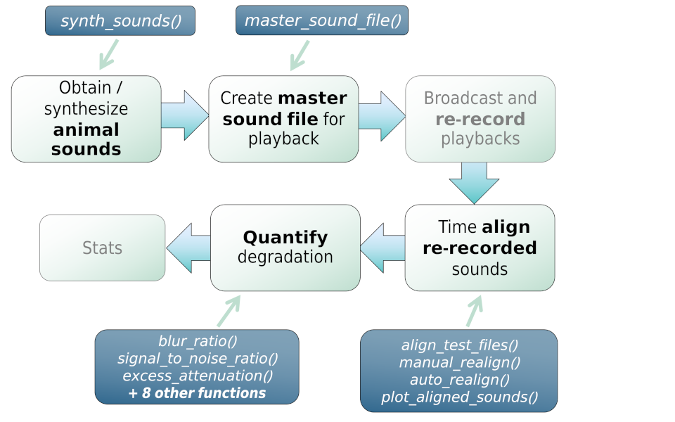

baRulho: quantifying degradation of (animal) sounds
================

<!-- README.md is generated from README.Rmd. Please edit that file -->
<!-- badges: start -->

[](https://github.com/ropensci/software-review/issues/609)[](https://lifecycle.r-lib.org/articles/stages.html)
[](https://cran.r-project.org/package=baRulho)
[](https://www.repostatus.org/#active)
[](https://www.gnu.org/licenses/gpl-3.0.en.html)
[](https://cran.r-project.org/)
[](commits/develop)
[](/commits/master)
[](https://cran.r-project.org/package=baRulho)
[](https://cranlogs.r-pkg.org/badges/grand-total/baRulho)
[](https://app.codecov.io/gh/maRce10/baRulho?branch=master)
[](https://github.com/maRce10/baRulho/actions/workflows/R-CMD-check.yaml)
<!-- badges: end -->


[baRulho](https://cran.r-project.org/package=baRulho) is intended to
facilitate the implementation of (animal) sound transmission
experiments, which typically aim to quantify changes in signal structure
when transmitted in a given habitat by broadcasting and re-recording
animal sounds at increasing distances. A common sequence of steps to
experimentally test hypotheses related to sound transmission is depicted
in the following diagram:

<div class="figure" style="text-align: center">


<p class="caption">
Figure 1. Diagram depicting a typical workflow for a experiment working
on signal tranmission and degradation. Nodes with black font indicate
steps that can be conducted using baRulho functions. Blue nodes denote
the functions that can be used at those steps.
</p>

</div>

 

[baRulho](https://marce10.github.io/baRulho/) offers functions for
critical steps in this workflow (those in black, including ‘checks’)
that required acoustic data manipulation and analysis.

The main features of the package are:

- The use of loops to apply tasks through sounds referenced in a
  selection table (sensu
  [warbleR](https://cran.r-project.org/package=warbleR))
- The production of image files with graphic representations of sound in
  time and/or frequency that let users verify acoustic analyses
- The use of annotation tables as the object format to input acoustic
  data and annotations and to output results
- The use of parallelization to distribute tasks among several cores to
  improve computational efficiency

[baRulho](https://marce10.github.io/baRulho/) builds upon functions and
data formats from the
[warbleR](https://cran.r-project.org/package=warbleR) and
[seewave](https://cran.r-project.org/package=seewave) packages, so some
experience with these packages is advised.

Take a look at the vignettes for an overview of the main features of the
packages:

- [Align test
  sounds](https://marce10.github.io/baRulho/articles/align_test_sounds.html)
- [Quantify
  degradation](https://marce10.github.io/baRulho/articles/quantify_degradation.html)

## Installing baRulho

Install/load the package from CRAN as follows:

``` r
# From CRAN would be
# install.packages("baRulho")

# load package
library(baRulho)
```

To install the latest developmental version from
[github](https://github.com/) you will need the R package
[remotes](https://cran.r-project.org/package=remotes):

``` r
# From github
remotes::install_github("maRce10/baRulho")

# load package
library(baRulho)
```

Further system requirements due to the dependency
[seewave](https://rug.mnhn.fr/seewave/) may be needed. Take a look a
[this link](https://rug.mnhn.fr/seewave/inst.html) for instruction on
how to install/troubleshoot these external dependencies.

## Other packages

The packages [seewave](https://cran.r-project.org/package=seewave) and
[tuneR](https://cran.r-project.org/package=seewave) provide a huge
variety of functions for acoustic analysis and manipulation. They mostly
work on wave objects already imported into the R environment. The
package [warbleR](https://cran.r-project.org/package=warbleR) provides
functions to visualize and measure sounds already referenced in
annotation tables, similar to
[baRulho](https://marce10.github.io/baRulho/). The package
[Rraven](https://cran.r-project.org/package=Rraven) facilitates the
exchange of data between R and [Raven sound analysis
software](https://www.ravensoundsoftware.com/) ([Cornell Lab of
Ornithology](https://www.birds.cornell.edu/home)) and can be very
helpful for incorporating Raven as the annotating tool into acoustic
analysis workflow in R. The package
[ohun](https://github.com/ropensci/ohun) works on automated detection of
sound events, providing functions to diagnose and optimize detection
routines.

## Citation

Please cite [baRulho](https://marce10.github.io/baRulho/) as follows:

Araya-Salas, M. (2020), *baRulho: quantifying degradation of (animal)
acoustic signals in R*. R package version 1.0.0.

## References

1.  Dabelsteen, T., Larsen, O. N., & Pedersen, S. B. (1993).
    *Habitat-induced degradation of sound signals: Quantifying the
    effects of communication sounds and bird location on blur ratio,
    excess attenuation, and signal-to-noise ratio in blackbird song*.
    The Journal of the Acoustical Society of America, 93(4), 2206.

2.  Marten, K., & Marler, P. (1977). *Sound transmission and its
    significance for animal vocalization*. Behavioral Ecology and
    Sociobiology, 2(3), 271-290.

3.  Morton, E. S. (1975). *Ecological sources of selection on avian
    sounds*. The American Naturalist, 109(965), 17-34.
