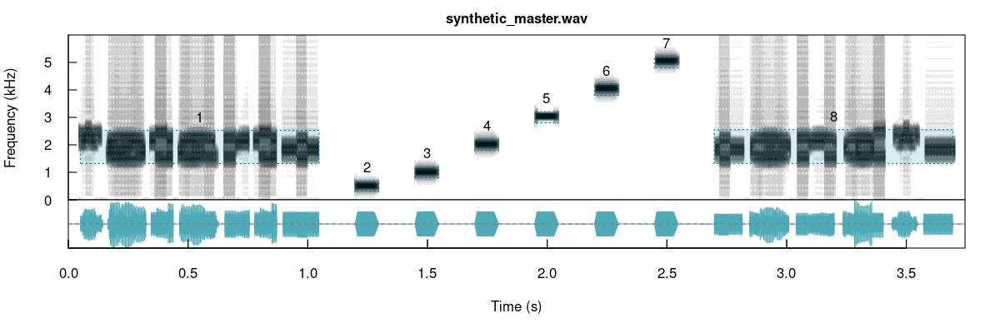
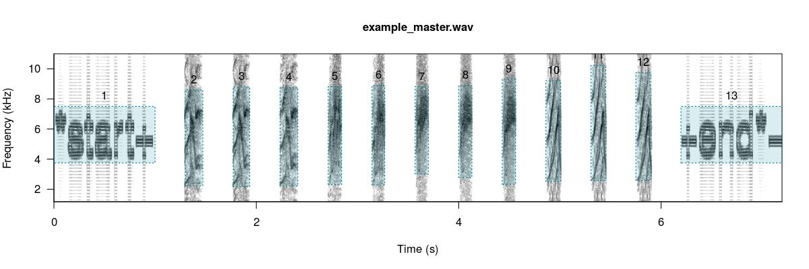
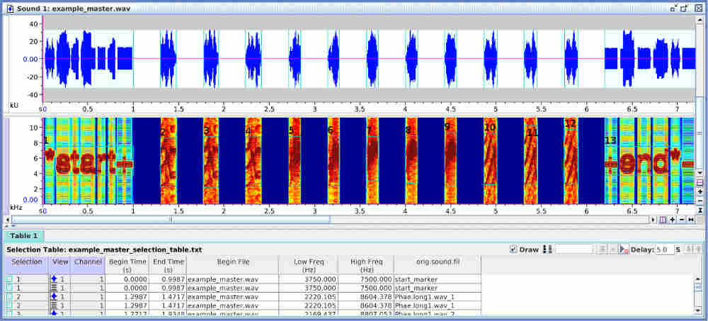
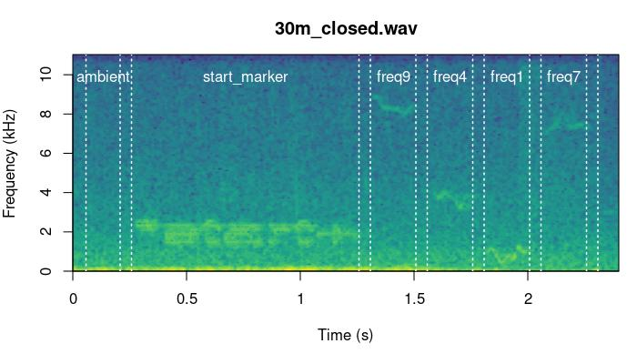
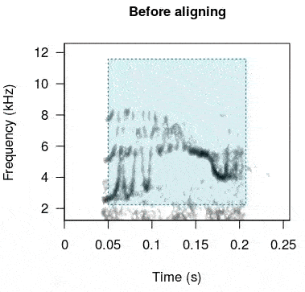

<!-- <script> -->
<!--    $(document).ready(function() { -->
<!--      $head = $('#header'); -->
<!--      $head.prepend('') -->
<!--    }); -->
<!-- </script> -->

<!-- &nbsp;  -->


<!-- <center></center> -->
</center>

&nbsp; 
```{r, eval = TRUE, echo = FALSE, message=FALSE}

# global option chunks
knitr::opts_chunk$set(dpi = 70,
                      fig.width = 8,
                      fig.height = 6)

# load package
library(baRulho)
library(kableExtra)

# also set a working directory, for this example we will use a temporary directory
td <- tempdir()

opts_chunk$set(
  tidy = TRUE,
  fig.align = "center",
  message = FALSE,
  warning = FALSE
)
```


This vignette shows deals with two things: how to create synthetic sounds for playback experiments and how to align re-recorded sounds to their reference once playback has been conducted. Here is some terms that will be used in this vignettes and throughout the package.

<div class="alert alert-info">

<font size="5">Glossary</font> 

-**Model sound**: sound in which transmission properties will be studied, usually found in the original field recordings or synthetic sound files.

-**Reference sound**: sound to use as a pattern to compare against. Usually created by re-recording a model sound broadcast at 1 m from the source (speaker).

-**Sound ID**: ID of sounds used to identify counterparts across distances. Each sound must have a unique ID within a distance.

-**Ambient noise**: energy from background sounds in the recording, excluding sounds of interest.  

-**Test sound**: sounds re-recorded far from the source to test for transmission/degradation (also refer to as 're-recorded' sounds).

-**Degradation**: loose term used to describe any changes in the structure of a sound when transmitted in a habitat.

</div>

&nbsp;

--- 

# Synthesize sounds

We often want to figure out how transmission properties vary across a range of frequencies.
For instance, Tobias et al (2010) studied whether acoustic adaptation (a special case of sensory drive; Morton 1975), could explain song evolution in Amazonian avian communities.  To test this the authors created synthetic pure tone sounds that were used as playback and re-recorded in different habitats. This is the actual procedure of creating synthetic sounds as they described it: 

> "Tones were synthesized at six different frequencies (0.5, 1.0, 2.0, 3.0, 4.0, and 5.0 kHz) to encompass the range of maximum avian auditory sensitivity (Dooling 1982). At each frequency, we generated two sequences of two 100-msec tones. One sequence had  a  relatively  short  interval  of  150  msec,  close  to  the  mean internote interval in our sample (152± 4 msec). The other sequence had a longer interval of 250 msec, close to the mean maximum internote interval in our sample (283± 74 msec). The first sequence reflects a fast-paced song and the second a slower paced song  (sensu  Slabbekoorn  et  al.  2007).  The  master  file  (44100 Hz/16 bit WAV) thereby consisted of a series of 12 pairs of artificial 100-ms constant-frequency tones at six different frequencies (0.5, 1.0, 2.0, 3.0, 4.0, and 5.0 kHz)." 

We can synthesize the same pure tones using the function `synth_sounds()`. The function requires 1) the frequencies of tones to synthesize (argument `frequencies`, in kHz) and 2) the duration of the tones (`durations`, in seconds). In addition, logical arguments `fm` and `am` allow to create frequency and amplitude modulated sounds respectvelty. In our case we need six tones of 100 ms at 0.5, 1, 2, 3, 4, and 5 kHz separated by intervals of 150 ms (at least for the first synthetic file described in Tobias et al 2010). We can also get a selection table (sensu [warbleR](https://cran.r-project.org/package=warbleR)) with the information about the time and frequency location of every sound. This would be required in order to make the master sound file. To get the selection table we need to set the argument `selec.table = TRUE`. This can be done as follows:


```{r, eval = TRUE, fig.height=5, dpi=120, message=FALSE, warning=FALSE}

# load packages
library(viridis)
library(baRulho)

# synthesize
synth_est <- synth_sounds(
  mar = 0.1,
  frequencies = c(0.5, 1:5),
  durations = 0.1,
  fm = FALSE,
  am = FALSE,
  sampling.rate = 12
)

td <- tempdir()

# export into a single file
Rraven::exp_est(
  X = synth_est,
  single.file = TRUE,
  path = td,
  file.name = "synth_sounds.wav"
)

# plot spectro
seewave::spectro(
  readWave(file.path(td, "synth_sounds.wav")),
  scale = FALSE,
  palette = viridis,
  grid = FALSE,
  flim = c(0, 5.5),
  collevels = seq(-20, 0, 1),
  osc = TRUE, colwave = "#482878FF",
  heights = c(2, 1), 
  wl = 100
)

```

&nbsp;

The function can add complexity to additional acoustic dimensions. For instance the following code generates all possible combinations of frequencies (2, 3 and 4 kHz), durations (0.1, and 0.2 s), frequency modulation (tonal and modulated) and amplitude modulation (flat and modulated envelope):

```{r, eval = TRUE, echo = TRUE, fig.height=5, dpi=120, message=FALSE, warning=FALSE}

# synthesize
synth_est2 <- synth_sounds(
  mar = 0.01, sig2 = 0.9,
  frequencies = 2:4,
  durations = c(0.1, 0.2),
  fm = TRUE,
  am = TRUE,
  shuffle = TRUE,
  seed = 123, 
  sampling.rate = 12
)

td <- tempdir()

# export in a single file
Rraven::exp_est(
  X = synth_est2,
  single.file = TRUE,
  path = td,
  file.name = "synth_sounds2.wav"
)

# plot spectro
seewave::spectro(
  readWave(file.path(td, "synth_sounds2.wav"), from = 0, to = 3, units = "seconds"),
  scale = FALSE,
  palette = viridis,
  grid = FALSE,
  flim = c(0.5, 5.5),
  collevels = seq(-20, 0, 1),
  osc = TRUE, colwave = "#482878FF",
  heights = c(2, 1),
  wl = 140
)

```

Note that the output is an extended selection table that contains the time-frequency annotations for all synthetic sounds:


```{r, eval = FALSE}
# check first 6 rows
head(as.data.frame(synth_est2))
```

```{r, eval = TRUE, echo=FALSE, results='asis'}

kbl <- kable(head(as.data.frame(synth_est2))
, align = "c", row.names = F, format = "html", escape = F)

kbl <- kable_styling(kbl, bootstrap_options = "striped", font_size = 14)


kbl <- scroll_box(kbl, width = "800px", height = "300px")

kbl
```
&nbsp;

As this is an extended selection table, the 'sound.files' column refers to Wave objects included as attributes instead of files in a directory:

```{r}
# check name of wave objects
names(attributes(synth_est2)$wave.objects)
```

&nbsp;

# Create master sound file for playback

The function `master_sound_file()` creates a master sound file (as you probably guessed) for playback experiments. The function takes wave objects from an data frame or (extended) selection table containing the model sounds and concatenates them in a single sound file (with some silence in between sounds which length can be modified). `master_sound_file()` adds acoustic markers at the start and end of the playback that can be used to time-sync re-recorded sounds, which streamlines quantification of acoustic degradation. 
The following example shows how to create a master sound file using the synthetic sounds generated above. For the synthetic sounds we need to add a little space between the top and bottom frequency because `sim_songs()` make those values exactly the same for pure tones: 

```{r, eval = FALSE, echo = TRUE}

# create master sound file
synth_master_annotations <- master_sound_file(
  X = synth_est, file.name = "synthetic_master",
  dest.path = td, gap.duration = 0.15
)

check_sels(synth_master_annotations, path =td)
```

&nbsp;

The function saves the master sound file as a wave file and returns a selection table in the R environment with the time and frequency 'coordinates' of the sounds in that file. We can look at the spectrogram of the output file using the [warbleR](https://cran.r-project.org/package=warbleR) function `spectrograms()` as follows:

```{r, eval=FALSE, echo=TRUE}

# plot spectro (saved in working directory)
spectrograms(
  X = synth_master_annotations,
  path = td,
  dest.path = td,
  by.song = "sound.files",
  xl = 3,
  collevels = seq(-60, 0, 5),
  osci = TRUE, 
  wl = 140
)

```

 

The function can also create a master sound file from sounds found in sound files and from several sounds files, as is likely the case with recordings collected in the field. The following example shows how to create a master sound file using several sound files. The code uses the example data and recordings from the package [warbleR](https://cran.r-project.org/package=warbleR):

```{r, eval = FALSE, echo = TRUE}

# load example data from warbleR
data(list = c(
  "Phae.long1", "Phae.long2", "Phae.long3", "Phae.long4",
  "lbh_selec_table"
))

# save sound files to temporary folder
writeWave(Phae.long1, file.path(td, "Phae.long1.wav"))
writeWave(Phae.long2, file.path(td, "Phae.long2.wav"))
writeWave(Phae.long3, file.path(td, "Phae.long3.wav"))
writeWave(Phae.long4, file.path(td, "Phae.long4.wav"))

# make an extended selection table
est <- selection_table(
  X = lbh_selec_table, extended = TRUE, confirm.extended = FALSE,
  path = td
)

# create master sound file
master_annotations <- master_sound_file(
  X = est, file.name = "example_master",
  dest.path = td, gap.duration = 0.3
)
```

&nbsp;

Again, we can look at the spectrogram of the output file:

```{r, eval=FALSE, echo=TRUE}

spectrograms(master_annotations,
  path = td, by.song = "sound.files",
  xl = 3, collevels = seq(-60, 0, 5), osci = TRUE
)
```


 

Note that the output could also be exported to [Raven sound analysis software](https://ravensoundsoftware.com/software/raven-pro) ([Cornell Lab of Ornithology](https://www.birds.cornell.edu/home)) for visualization or further manipulation using the function `exp_raven()` from the [Rraven](https://cran.r-project.org/package=Rraven) package. `exp_raven()` exports selections in the R environment to a '.txt' file that can be read in Raven:
 

```{r, eval = FALSE}

Rraven::exp_raven(master_annotations, path = td, file.name = "example_master_selection_table")
```

&nbsp;

Both sound files and annotations can be visualized in Raven ( acoustic analysis software):

 

&nbsp;

Take a look at the [Rraven vignette](https://CRAN.R-project.org/package=Rraven/vignettes/Rraven.html) for more details on how to export data from R to Raven. 

Note that the start and end markers are placed at relatively low amplitudes so they are less affected by degradation. The frequency range of markers can be set with argument `flim`. The relative amplitude of markers can also be adjusted with the `amp.marker` argument. Amplitude of markers will be multiplied by the value supplied so markers will be louder than sounds. These two features should increases the chances of being "detected" at further distances regardless of the amplitude of sounds. 

# Align re-recorded sounds

Once we went to the field (or lab) and re-recorded the master sound files at different distances, we are ready to start with data analysis. The first step for getting the data ready for analysis involves finding sounds within the re-recorded sound files. We only need to align the start marker between the master playback and the re-recorded sound files, based on the fact that the time difference between the marker and the sounds should be the same in both cases:


 <center></center>

&nbsp;

We will use acoustic data included in the package as example data. This is a data subset from a sound transmission experiment. The complete data set of the experiment is hosted in [this repository](https://figshare.com/articles/media/baRulho_an_R_package_to_quantify_animal_acoustic_signal_transmission_and_degradation/21559074). There are two example objects that will be used: 

```{r}
data("master_est")

data("test_sounds_est")
```
&nbsp;

These are the files contained in the data set:

```{r}

unique(master_est$sound.files)
unique(test_sounds_est$sound.files)
```

&nbsp;

Their names are self-explanatory: a master sound file ("master.wav") and its annotations, a reference sound file ("reference_1m.wav") and two test files ("test_10m.wav" and "test_20m.wav") re-recorded at 10 and 20 m respectively.

Now we will save those files in a temporary working directory (those objects are extended selection tables in the R environment) to resemble the usual case in which the acoustic data is found in sound files.

```{r}

# first remove any other wave file in the temporary working directory (dont do it with yourd data!)
unlink(list.files(path = td, full.names = TRUE, pattern = ".wav"))

# save master sound file
writeWave(object = attr(master_est, "wave.objects")[[1]], file.path(td, "master.wav"))

# save test sound files
for (i in unique(test_sounds_est$sound.files)) {
  writeWave(object = attr(test_sounds_est, "wave.objects")[[i]], file.path(td, i))
}

# make annotations a data frame
master_annotations <- as.data.frame(master_est)
```
&nbsp;

To find the location of the start marker on the test sound files we use the functions `find_markers()` to run a cross-correlation of one or more markers across the test files in order to determine the exact time in which each marker is found: 

```{r, eval = FALSE}
options(sound.files.path = td)

markers_position <- find_markers(X = master_annotations)

markers_position
```

```{r, eval = TRUE, echo=FALSE, results='asis'}

# set path globally (so no need to write it each time)
options(sound.files.path = td)

markers_position <- find_markers(X = master_annotations, pb= FALSE)

kbl <- kable(markers_position, align = "c", row.names = F, format = "html", escape = F)

kbl <- kable_styling(kbl, bootstrap_options = "striped", font_size = 14)

kbl
```

&nbsp;

The position of the markers is determined as the highest spectrogram cross-correlation value for each marker using the functions `template_correlator()` and `template_detector` from the package [ohun](https://CRAN.R-project.org/package=ohun). If two or more markers are used the function computes an additional column, 'time.mismatch', that compares the time difference between the two markers in the test-files against that in the master sound file. In a perfect detection the value must be 0. So this number can be used as a measure of error. In some cases precision can improve by increasing the time resolution of the spectrogram, that is, by lowering the size of the time window. This is done with the argument 'hop.size'. By default it is 11.6 ms (which is equivalent to a 512 samples window length in a 44.1 kHz file). Let's try 4 ms: 
```{r, eval = FALSE}

# lower window length
markers_position <- find_markers(X = master_annotations, hop.size = 4)

markers_position
```
&nbsp;

With the time location of acoustic markers we can infer the position of all other sounds in the new recordings. A selection table from re-recorded files can be generated using the function `align_test_files()`:

```{r, eval = TRUE}

aligned_tests <-
  align_test_files(
    X = master_annotations,
    Y = markers_position,
    by.song = TRUE,
    remove.markers = FALSE
  )
```

&nbsp;

The function returns an object of the same class of the input object 'X'. In this case 'X' is an `extended_selection_table` created 'by.song' (see '?selection_table()'):
```{r, eval = FALSE}

is_extended_selection_table(aligned_tests)

aligned_tests
```

```{r, eval = TRUE, echo = FALSE}

print(TRUE)
```

```{r, eval = TRUE, echo = FALSE, results='asis'}

kbl <- kable(aligned_tests, align = "c", row.names = F, format = "html", escape = F)

kbl <- kable_styling(kbl, bootstrap_options = "striped", font_size = 14)

kbl <- scroll_box(kbl, width = "800px", height = "300px")

kbl
```
&nbsp;

This format is similar to data frames, although it also contains all the acoustic data as attributes so there is no need to refer to sound files in a directory any more.  [baRulho](https://marce10.github.io/baRulho/) functions that quantify degradation can take data frames, selection tables and extended selection tables.  

We can also check the precision of the alignment by looking at the spectrograms. The function `plot_aligned_sounds()` can create spectrograms to visually inspect alignment precision on test sound files. The spectrograms are saved as individual JPEG image files (in 'dest.path' if supplied). One file is created for each sound file:

```{r, eval = FALSE}

plot_aligned_sounds(X = aligned_tests, dest.path = tempdir(), duration = 2.4, ovlp = 0)
```

 These are two of the files generated by the code above:

 

 

&nbsp;

---

### Further aligning

When this process is done manually (or when broadcasting devices add some short delays as the case of some bluetooth transmitters) there could be some small misalignment between the inferred versus the actual start time of re-recorded sounds. This is problematic for quantifying degradation in [baRulho](https://marce10.github.io/baRulho/) (and other sound analysis software) as precise alignment of sound is crucial for the accuracy of downstream measures of sound degradation. 

Misalignment can be fixed with the function `realign_test_sounds()`. This function uses spectrogram cross-correlation to sync the position in time of sounds with regard to a reference sound. `realign_test_sounds()` takes the sound recorded at the closest distance to the source as the reference sound. The function calls [warbleR](https://cran.r-project.org/package=warbleR)'s `cross_correlation()` (just as we did above) internally to align sounds using cross-correlation. 
We can simulate a aligned data set in which test sound are slightly off their position: 

```{r}

unaligned_test_sounds_est <- test_sounds_est
set.seed(123)
noise_time <- sample(c(0.005, -0.005, 0.006, -0.006, 0, 0.002, -0.002),
  nrow(unaligned_test_sounds_est),
  replace = TRUE
)
attr(unaligned_test_sounds_est, "check.res")$start <-
  unaligned_test_sounds_est$start <- unaligned_test_sounds_est$start + noise_time
attr(unaligned_test_sounds_est, "check.res")$end <- unaligned_test_sounds_est$end <-
  unaligned_test_sounds_est$end + noise_time
```

Now we can re-aligned test sounds:
```{r, eval = FALSE}

# re align
rts <- realign_test_sounds(X = unaligned_test_sounds_est)
```

This is how the sounds look before and after being aligned:
```{r, eval = FALSE, echo = FALSE}

# rename sound files so aligned and unaligned sounds are intercalated
unalg <- rename_waves_est(playback_est_unaligned, playback_est_unaligned$sound.files, new.selec = seq(1, 200, by = 2)[1:nrow(playback_est_unaligned)])
alg <- rename_waves_est(playback_est_aligned, playback_est_aligned$sound.files, new.selec = seq(2, 200, by = 2)[1:nrow(playback_est_aligned)])

# add label
unalg$type <- "Before aligning"
alg$type <- "After aligning"

# put together in a single ext sel tab
unalg.alg <- rbind(unalg, alg)

# create spectrograms
spectrograms(unalg.alg[unalg.alg$sound.id != "ambient", ], dest.path = tempdir(), res = 100, wl = 300, title.labels = "type", sel.labels = NULL)
```


<center></center>

&nbsp;

In case this doesn't work as expected there is another option. The function `seltailor()` from [warbleR](https://cran.r-project.org/package=warbleR) allows user to manually adjust the start and end of sounds in a extended selection table.

&nbsp;


---

Please report any bugs [here](https://github.com/maRce10/baRulho/issues). 

The package [baRulho](https://marce10.github.io/baRulho/) should be cited as follows:

Araya-Salas, M. (2020), *baRulho: quantifying habitat-induced degradation of (animal) acoustic signals in R*. R package version 1.0.0.

---

# References

1. Araya-Salas, M. (2017). *Rraven: connecting R and Raven bioacoustic software*. R package version 1.0.0.

1.  Araya-Salas, M. (2020), *baRulho: quantifying habitat-induced degradation of (animal) acoustic signals in R*. R package version 1.0.0
  
1. Araya-Salas M, Smith-Vidaurre G. (2017) *warbleR: An R package to streamline analysis of animal acoustic signals*. Methods Ecol Evol 8:184–191.

1. Dabelsteen, T., Larsen, O. N., & Pedersen, S. B. (1993). *Habitat-induced degradation of sound signals: Quantifying the effects of communication sounds and bird location on blur ratio, excess attenuation, and signal-to-noise ratio in blackbird song*. The Journal of the Acoustical Society of America, 93(4), 2206.

1. Marten, K., & Marler, P. (1977). *Sound transmission and its significance for animal vocalization. Behavioral* Ecology and Sociobiology, 2(3), 271-290.

1. Morton, E. S. (1975). *Ecological sources of selection on avian sounds*. The American Naturalist, 109(965), 17-34.

1. Tobias, J. A., Aben, J., Brumfield, R. T., Derryberry, E. P., Halfwerk, W., Slabbekoorn, H., & Seddon, N. (2010). *Song divergence by sensory drive in Amazonian birds*. Evolution, 64(10), 2820-2839.

---

<font size="4">Session information</font>

```{r session info, echo=F}

sessionInfo()
```
