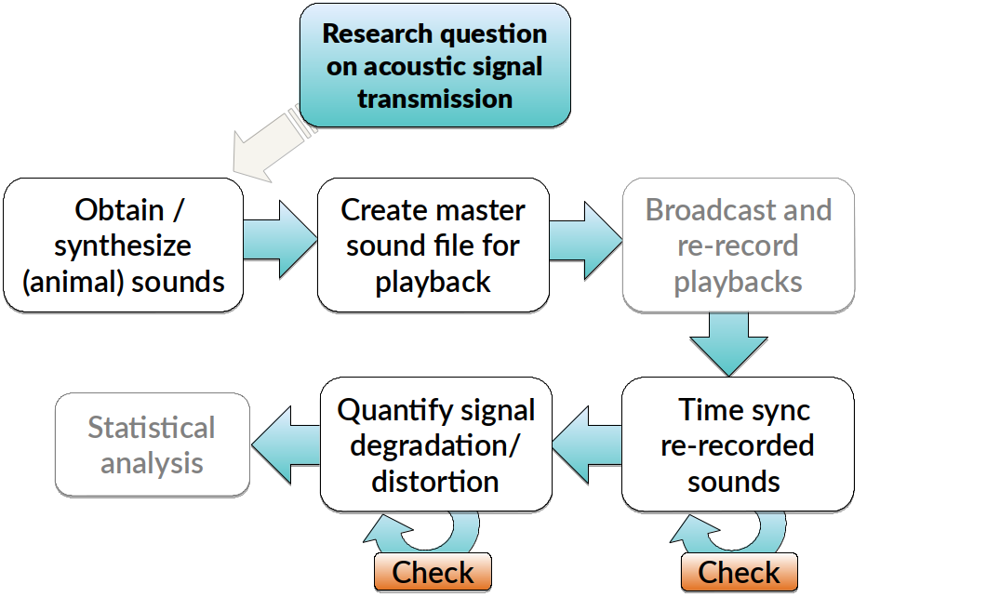
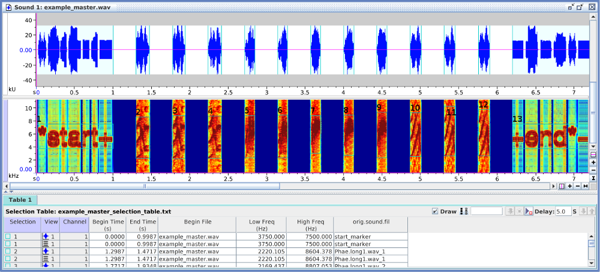

<!-- <script> -->
<!--    $(document).ready(function() { -->
<!--      $head = $('#header'); -->
<!--      $head.prepend('') -->
<!--    }); -->
<!-- </script> -->

<!-- &nbsp;  -->


<!-- <center></center> -->

&nbsp; 


The [baRulho](https://cran.r-project.org/package=baRulho) package is intended to facilitate the acoustic analysis of (animal) sound transmission experiments. In such experiments animal sounds are broadcast and re-recorded at increasing distance. These type of studies typically aim to quantify changes in signal structure when transmitted in a given habitat. We will call these changes 'degradation' for the sake of simplicity. The package offers a workflow with functions for preparing the data set for analysis as well as calculating and visualizing several degradation metrics. [baRulho](https://cran.r-project.org/package=baRulho) builds upon functions and data formats from the [warbleR](https://cran.r-project.org/package=warbleR) and [seewave](https://cran.r-project.org/package=seewave) packages, so some experience with these packages is adviced.


The main features of the package are:

 - The use of loops to apply tasks through acoustic signals referenced in a selection table
 - The production of image files with spectrograms that let users verify acoustic analyzes 
 - The use extended selection tables as the object format to input acoustic data and annotations (except for 'atmospheric_attenuation()') and to output results 
 - The use of parallelization to distribute tasks among several cores to improve computational efficiency

The package can be install/load from CRAN as follows:

```{r, eval = FALSE}

# From CRAN would be
install.packages("baRulho")

#load package
library(baRulho)

```

To install the latest developmental version from [github](http://github.com/) you will need the R package [devtools](https://cran.r-project.org/package=devtools):

```{r, eval = FALSE}

# From github
devtools::install_github("maRce10/baRulho")

#load package
library(baRulho)
library(warbleR)

```

```{r, eval = TRUE, echo = FALSE}

#load package
library(baRulho)
library(kableExtra)
library(warbleR)

```


### Inputting acoustic data and annotations

The package requires the data to be input as extended selection tables. An extended selection table is an object class in R that contains both the annotations (locations of signals in time and frequency) and the corresponding acoustic data as 'wave' objects. Therefore, these are **self-contained objects** since the original sound files are no longer needed to perform acoustic analyses. This objects are created by the `selection_table()` function from [warbleR](https://cran.r-project.org/package=warbleR). Take a look at the [intro to warbleR vignette](https://cran.r-project.org/web/packages/Rraven/vignettes/Rraven.html) for more details.

<div class="alert alert-info">

<font size="5">Glossary</font> 

- **Model signal**: recording of a specific signal type to be used to represent that signal type.

- **Reference signal**: signal to use as a pattern to compare against. Usually created by re-recording a model signal broadcast at 1 m from the source (speaker).

- **Signal type**: signal category. For instance song types (e.g. A, B, C), call types (alert, foraging, etc).

- **Ambient noise**: background sound in the recording excluding signals of interest.  

- **Degradation**: Generic term for any changes in signal structure when transmitted in a given habitat.

</div>

&nbsp;

--- 

# Workflow of sound processing and analysis

A common sequence of steps to experimentally test hypotheses related to signal transmission is depicted in the following diagram:

 <center></center>

&nbsp;

[baRulho](https://cran.r-project.org/package=baRulho) offers functions for critical steps in this workflow (those in black, including 'checks') that required acoustic data manipulation and analysis. The tools available in this package will be presented following the above workflow.

&nbsp;

# Create master sound file for playback

The function `master_sound_file()` creates a master sound file (as you probably guessed) for use in playback experiments. The function takes wave objects from an extended selection table containing the model signals and concatenate them in a single sound file (with some silence in between signals). `master_sound_file()` also adds acoustic markers at the start and end of the playback that can be used to time-sync re-recorded signals, which allows to streamline quantification of acoustic degradation. 

The following example shows how to create a master sound file using the example data and recordings from the package [warbleR](https://cran.r-project.org/package=warbleR):

```{r, eval = FALSE, echo = TRUE}

# load example data from warbleR
data(list = c("Phae.long1", "Phae.long2", "Phae.long3", "Phae.long4", 
"lbh_selec_table"))

# save sound files to temporary folder
writeWave(Phae.long1, file.path(tempdir(), "Phae.long1.wav"))
writeWave(Phae.long2, file.path(tempdir(), "Phae.long2.wav"))
writeWave(Phae.long3, file.path(tempdir(), "Phae.long3.wav"))
writeWave(Phae.long4, file.path(tempdir(), "Phae.long4.wav"))

# make an extended selection table
est <- selection_table(X = lbh_selec_table, extended = TRUE, confirm.extended = FALSE, 
path = tempdir())

# create master sound file
master.sel.tab <- master_sound_file(X = est, file.name = "example_master", 
dest.path = tempdir(), gap.duration = 0.3)

```

&nbsp;

The function saves the master sound file as a wave file and returns a selection table in the R environment with the time and frequency 'coordinates' of the signals in the file. We can look at the spectrogram of the output file using the [warbleR](https://cran.r-project.org/package=warbleR) function `spectrograms()` as follows:

```{r, eval=FALSE, echo=TRUE}

spectrograms(master.st, path = tempdir(), by.song = "sound.files", 
           xl = 3, collevels = seq(-60, 0, 5))

```

 

The output could also be explored in [Raven sound analysis software](http://www.birds.cornell.edu/brp/raven/RavenOverview.html) ([Cornell Lab of Ornithology](http://www.birds.cornell.edu)) using the function `exp_raven()` from the [Rraven](https://cran.r-project.org/package=Rraven) package. `exp_raven()` exports selections in the R environment to a '.txt' file that can be read in Raven:
 

```{r, eval = FALSE}
 
 Rraven::exp_raven(master.sel.tab, path = tempdir(), file.name = "example_master_selection_table")

```

&nbsp;

Both sound files and annotations can be visualized in Raven:

 

&nbsp;

Take a look at the [Rraven vignette](https://cran.r-project.org/web/packages/Rraven/vignettes/Rraven.html) for more details. 

# Time sync re-recorded sounds

Once we went to the field (or lab?) and re-recorded the master sound files at different distances, we are ready to start with data analysis. The first step for getting the data ready to analysis involves finding the position of the re-recorded signals in those new sound files. To do this we just need to align the start marker between the master playback and the re-recorded sound files, as the time difference between the marker and the signals should be the same in both cases. To find the location of the start marker we can use the [warbleR](https://cran.r-project.org/package=warbleR) functions `xcorr()` to run a cross-correlation of the marker across the re-recorded sound file and `find_peaks()` to determine the exact time in which the marker is found. We can do this as follows (check [warbleR](https://cran.r-project.org/package=warbleR) documentation for more information on how this functions work): 

```{r, eval = FALSE}

# create a matrix that contains the selection/files to be cross-correlated
comp_mat <- matrix(c(paste(master.st$sound.files[1], master.st$selec[1], sep = "-"), "example_master.wav"),nrow = 1)

# run cross correlation
xc <- xcorr(master.st, compare.matrix = comp_mat, wl = 300, ovlp = 30, path = tempdir(), output = "list")

# find peaks
pks <- find_peaks(xc.output = xc, max.peak = TRUE, path = tempdir())

```

```{r, eval = FALSE, echo=FALSE}

kbl <- kable(pks, align = "c", row.names = F,  format = "html", escape = F)

kbl <-  kable_styling(kbl, bootstrap_options = "striped", font_size = 14)

kbl

```

&nbsp;

<table class="table table-striped" style="font-size: 12px; margin-left: auto; margin-right: auto;">
 <thead>
  <tr>
   <th style="text-align:center;"> sound.files </th>
   <th style="text-align:center;"> selec </th>
   <th style="text-align:center;"> start </th>
   <th style="text-align:center;"> end </th>
   <th style="text-align:center;"> template </th>
   <th style="text-align:center;"> time </th>
   <th style="text-align:center;"> score </th>
  </tr>
 </thead>
<tbody>
  <tr>
   <td style="text-align:center;"> example_master.wav </td>
   <td style="text-align:center;"> 1 </td>
   <td style="text-align:center;"> 0.9999883 </td>
   <td style="text-align:center;"> 1.998655 </td>
   <td style="text-align:center;"> example_master.wav-1 </td>
   <td style="text-align:center;"> 1.499322 </td>
   <td style="text-align:center;"> 0.9452399 </td>
  </tr>
</tbody>
</table>

The output of `find_peaks()` indicate that the start marker is found starting at ~1 s (0.9999883 s), which was expected as `master_sound_file()` incerts a 1 second silence at the beggining of the master sound file. With this information we can infer the position of all other selections in the new recordings. The start of all signals in the re-recorded file can be calculated as the time difference between the start marker and each signal in the master sound file plus the start of the marker in the new file. Something like this:

```{r, eval = FALSE}

# start on new recording
new.start  <- master.st$start[!master.st$orig.sound.file %in%  c("start_marker", "end_marker")] - master.st$start[1] + pks$start[1]

new.start 
```

```{r, echo = FALSE}

new.start <- c(2.298655, 2.771722, 3.234833, 3.709811, 4.142433, 4.568611, 4.999855, 5.430077, 5.861322, 6.306788, 6.751011)

new.start 
```

The end of the signals would be their duration plus the start we just calulated:

```{r, eval = FALSE}

# get durations
durs  <- master.st$end[!master.st$orig.sound.file %in% c("start_marker", "end_marker")] - master.st$start[!master.st$orig.sound.file %in% c("start_marker", "end_marker")]

new.end <- new.start + durs
  
new.end
```

```{r, echo = FALSE}

new.end <- c(2.471722, 2.934833, 3.409811, 3.842433, 4.268611, 4.699855, 5.130077, 5.561321, 6.006789, 6.451010, 6.896167)

new.end
```

These is all the data we need to create a new selection table that will allow us to measure acoustic parameters on re-recorded signals. The new selection table can be put together as follows:

```{r, eval = FALSE}

# get subset exclufing markers
new.st  <- master.st[!master.st$orig.sound.file %in% c("start_marker", "end_marker"), ]

# fix time columns
new.st$start <- new.start
new.st$end <- new.end

# add distance column
new.st$distance <- 5

# make it an extended selection table
new.est <- selection_table(new.st, extended = TRUE, confirm.extended = FALSE, by.song = "sound.files", path = tempdir())

new.est
```


```{r, eval = FALSE,  echo = FALSE}

kbl <- kable(new.est, align = "c", row.names = F,  format = "html", escape = F)

kbl <-  kable_styling(kbl, bootstrap_options = "striped", font_size = 14)

kbl <- scroll_box(kbl, width = "800px", height = "300px")
kbl

```

<div style="border: 1px solid #ddd; padding: 0px; overflow-y: scroll; height:300px; "><table class="table table-striped" style="font-size: 12px; margin-left: auto; margin-right: auto;">
 <thead>
  <tr>
   <th style="text-align:center;position: sticky; top:0; background-color: #FFFFFF;"> sound.files </th>
   <th style="text-align:center;position: sticky; top:0; background-color: #FFFFFF;"> selec </th>
   <th style="text-align:center;position: sticky; top:0; background-color: #FFFFFF;"> start </th>
   <th style="text-align:center;position: sticky; top:0; background-color: #FFFFFF;"> end </th>
   <th style="text-align:center;position: sticky; top:0; background-color: #FFFFFF;"> bottom.freq </th>
   <th style="text-align:center;position: sticky; top:0; background-color: #FFFFFF;"> top.freq </th>
   <th style="text-align:center;position: sticky; top:0; background-color: #FFFFFF;"> orig.sound.file </th>
   <th style="text-align:center;position: sticky; top:0; background-color: #FFFFFF;"> distance </th>
  </tr>
 </thead>
<tbody>
  <tr>
   <td style="text-align:center;"> example_master.wav </td>
   <td style="text-align:center;"> 2 </td>
   <td style="text-align:center;"> 2.298667 </td>
   <td style="text-align:center;"> 2.471733 </td>
   <td style="text-align:center;"> 2.220105 </td>
   <td style="text-align:center;"> 8.604378 </td>
   <td style="text-align:center;"> Phae.long1.wav_1 </td>
   <td style="text-align:center;"> 5 </td>
  </tr>
  <tr>
   <td style="text-align:center;"> example_master.wav </td>
   <td style="text-align:center;"> 3 </td>
   <td style="text-align:center;"> 2.771733 </td>
   <td style="text-align:center;"> 2.934844 </td>
   <td style="text-align:center;"> 2.169437 </td>
   <td style="text-align:center;"> 8.807053 </td>
   <td style="text-align:center;"> Phae.long1.wav_2 </td>
   <td style="text-align:center;"> 5 </td>
  </tr>
  <tr>
   <td style="text-align:center;"> example_master.wav </td>
   <td style="text-align:center;"> 4 </td>
   <td style="text-align:center;"> 3.234844 </td>
   <td style="text-align:center;"> 3.409822 </td>
   <td style="text-align:center;"> 2.218294 </td>
   <td style="text-align:center;"> 8.756604 </td>
   <td style="text-align:center;"> Phae.long1.wav_3 </td>
   <td style="text-align:center;"> 5 </td>
  </tr>
  <tr>
   <td style="text-align:center;"> example_master.wav </td>
   <td style="text-align:center;"> 5 </td>
   <td style="text-align:center;"> 3.709822 </td>
   <td style="text-align:center;"> 3.842444 </td>
   <td style="text-align:center;"> 2.316862 </td>
   <td style="text-align:center;"> 8.822316 </td>
   <td style="text-align:center;"> Phae.long2.wav_1 </td>
   <td style="text-align:center;"> 5 </td>
  </tr>
  <tr>
   <td style="text-align:center;"> example_master.wav </td>
   <td style="text-align:center;"> 6 </td>
   <td style="text-align:center;"> 4.142444 </td>
   <td style="text-align:center;"> 4.268622 </td>
   <td style="text-align:center;"> 2.284006 </td>
   <td style="text-align:center;"> 8.888027 </td>
   <td style="text-align:center;"> Phae.long2.wav_2 </td>
   <td style="text-align:center;"> 5 </td>
  </tr>
  <tr>
   <td style="text-align:center;"> example_master.wav </td>
   <td style="text-align:center;"> 7 </td>
   <td style="text-align:center;"> 4.568622 </td>
   <td style="text-align:center;"> 4.699867 </td>
   <td style="text-align:center;"> 3.006834 </td>
   <td style="text-align:center;"> 8.822316 </td>
   <td style="text-align:center;"> Phae.long3.wav_1 </td>
   <td style="text-align:center;"> 5 </td>
  </tr>
  <tr>
   <td style="text-align:center;"> example_master.wav </td>
   <td style="text-align:center;"> 8 </td>
   <td style="text-align:center;"> 4.999867 </td>
   <td style="text-align:center;"> 5.130089 </td>
   <td style="text-align:center;"> 2.776843 </td>
   <td style="text-align:center;"> 8.888027 </td>
   <td style="text-align:center;"> Phae.long3.wav_2 </td>
   <td style="text-align:center;"> 5 </td>
  </tr>
  <tr>
   <td style="text-align:center;"> example_master.wav </td>
   <td style="text-align:center;"> 9 </td>
   <td style="text-align:center;"> 5.430089 </td>
   <td style="text-align:center;"> 5.561333 </td>
   <td style="text-align:center;"> 2.316862 </td>
   <td style="text-align:center;"> 9.315153 </td>
   <td style="text-align:center;"> Phae.long3.wav_3 </td>
   <td style="text-align:center;"> 5 </td>
  </tr>
  <tr>
   <td style="text-align:center;"> example_master.wav </td>
   <td style="text-align:center;"> 10 </td>
   <td style="text-align:center;"> 5.861333 </td>
   <td style="text-align:center;"> 6.006800 </td>
   <td style="text-align:center;"> 2.513997 </td>
   <td style="text-align:center;"> 9.216586 </td>
   <td style="text-align:center;"> Phae.long4.wav_1 </td>
   <td style="text-align:center;"> 5 </td>
  </tr>
  <tr>
   <td style="text-align:center;"> example_master.wav </td>
   <td style="text-align:center;"> 11 </td>
   <td style="text-align:center;"> 6.306800 </td>
   <td style="text-align:center;"> 6.451022 </td>
   <td style="text-align:center;"> 2.579708 </td>
   <td style="text-align:center;"> 10.235116 </td>
   <td style="text-align:center;"> Phae.long4.wav_2 </td>
   <td style="text-align:center;"> 5 </td>
  </tr>
  <tr>
   <td style="text-align:center;"> example_master.wav </td>
   <td style="text-align:center;"> 12 </td>
   <td style="text-align:center;"> 6.751022 </td>
   <td style="text-align:center;"> 6.896178 </td>
   <td style="text-align:center;"> 2.579708 </td>
   <td style="text-align:center;"> 9.742279 </td>
   <td style="text-align:center;"> Phae.long4.wav_3 </td>
   <td style="text-align:center;"> 5 </td>
  </tr>
</tbody>
</table></div>

&nbsp;

Note that we also added a distance column that would be useful for downsteam analysis (and to keep track of the distance in which the signals were re-recorded!). In addition, the data was converted into an `extended_selection_table`, which is the data format that pretty much all [baRulho](https://cran.r-project.org/package=baRulho) functions can take. 

This is somehow a silly example as we are finding the star marker on the original master sound file. However, it's good enough to demonstrate how this can be done on any re-recorded sound file.

When this process is done manually (or when broadcasting devices add some short delays as the case of some bluetooth transmitters) there could be some small misalignment between the infered and the actual start time of re-recorded signals. This could be problematic for quantifying degradation in [baRulho](https://cran.r-project.org/package=baRulho) as precise alignment is crucial for the accuracy of downstream measures of signal degradation. 

Misalignment can be fixed with the funciton `spcc_align()`. This function uses spectrographic cross-correlation to sync the position in time of signals with regard to a reference signal. `spcc_align()` takes the signal recorded at the closest distance to the source as the reference signal. The function calls warbleR's \code{\link[warbleR]{xcorr}} and \code{\link[warbleR]{find_peaks}} (just as we did above) internally to align signals using cross-correlation. 

[baRulho](https://cran.r-project.org/package=baRulho) comes with an example data set called  `playback_est_unaligned`, which contains signals in which the time position of signals is slightly unaligned. We can use this data to show how the function `spcc_align()`: 

```{r, eval = FALSE}
 data("playback_est_unaligned")
 
 # method 1
playback_est_aligned <- spcc_align(X = playback_est_unaligned)

```

The output extended selection table contains the new start and end values after alignment. 

This is how the signals look before and after being aligned:

<center></center>

&nbsp;

In case this doesn't work as expected there is a plan B. The function `seltailor()` from [warbleR](https://cran.r-project.org/package=warbleR) allows user to manually adjust the start and end of signals in a extended selection table.

&nbsp;

# Quantifying signal degradation

Most [baRulho](https://cran.r-project.org/package=baRulho) functions are design to quantify acoustic signal degradation. There are a few important things to keep in mind about functions for quanitfying degradation:

- The package currently assumes that all recordings have been made with the same equipment and recording volume. This would be modified in future versions to allow amplitude calibration of recordings.
- Wave envelope and frequency spectrum calculations are made after applying a bandpass filter within the frequency range of the reference signal ('bottom.freq' and 'top.freq' columns)
- The package offers two methods for comparing signals against their reference: 
    1. Compare all signals with the counterpart that was recorded at the closest distance to source (e.g. compare a signal recorded at 5m, 10m and 15m with its counterpart recorded at 1m). This is the default method. 
  2. Compare all signals with the counterpart recorded at the distance immediately before (e.g. a signal recorded at 10m compared with the one recorded at 5m, then signal recorded at 15m compared with the one recorded at 10m and so on).


### Required data structure

As mentioned above the data must be input in the `extended_selection_table` format. The data should also contained some additional information. [baRulho](https://cran.r-project.org/package=baRulho) comes with an example `extended_selection_table` data set that can be used to understand the required data structure:

```{r,eval=FALSE}

data("playback_est")

playback_est
```


```{r, eval = TRUE, echo = FALSE}

data("playback_est")

kbl <- kable(playback_est, align = "c", row.names = F,  format = "html", escape = F)

kbl <- column_spec(kbl, 7:8, bold = TRUE)

kbl <-  kable_styling(kbl, bootstrap_options = "striped", font_size = 12)

kbl <- scroll_box(kbl, width = "800px", height = "400px")

kbl

```
&nbsp;
 
 Note that besides the basic acoustic annotation information (e.g. sound file, time, frequency) the table also contains a **'signal.type' column, which refers to the signal type from which each signal belongs to**, and a **'distance' column that refers to the distance from source at which each selection was recorded**. These two pieces of information are crucial in order to only compare signals from the same signal type and compare them to their counterpart at a closest distance to source. Also note that some selections are labeled as "ambient" in the 'signal.type'. These selections refer to ambient (background) noise. Ambient noise can be used by some functions to correct for amplitude differences due to non-target sounds.
 

### Blur ratio
 
Blur ratio quantifies the degradation of sound as a function of the change in signal energy in the time domain as described by Dabelsteen et al (1993). Low values indicate low degradation of signals. The function `blur_ratio()` measures the blur ratio on signals in which a reference playback has been re-recorded at different distances. Blur ratio is measured as the mismatch between amplitude envelopes (expressed as probability density functions) of the reference signal and the re-recorded signal. The function compares each signal type to the corresponding reference signal within the supplied frequency range (e.g. bandpass) of the reference signal ('bottom.freq' and 'top.freq' columns in 'X'). The 'signal.type' column must be used to tell the function to only compare signals belonging to the same category (e.g. song-types). All wave objects in the extended selection table must have the same sampling rate so the length of envelopes is comparable.

Blur ratio can be calculated as follows:

```{r, eval = FALSE}

# run blu ratio
br <- blur_ratio(playback_est, method = 1, pb = FALSE)

# check output class
is_extended_selection_table(br)
```

```{r, eval = TRUE, echo = FALSE}

# run blu ratio
br <- blur_ratio(playback_est, method = 1, pb = FALSE)

# check output class
is_extended_selection_table(br)

```

```{r, eval = FALSE}

# see output
br

```

```{r, echo = FALSE}

kbl <- kable(br, align = "c", row.names = F,  format = "html", escape = F)

kbl <-  column_spec(kbl, 9:10, background = "#ccebff")

kbl <-  kable_styling(kbl, bootstrap_options = "striped", font_size = 10)

kbl <- scroll_box(kbl, width = "800px", height = "400px")

kbl

```
 
Note
---

Please report any bugs [here](https://github.com/maRce10/baRulho/issues). The package [baRulho](https://cran.r-project.org/package=baRulho) should be cited as follows:

Araya-Salas, M. (2020), *baRulho: quantifying habitat-induced degradation of (animal) acoustic signals in R*. R package version 1.0.0.

# References

1. Araya-Salas, M. (2017), *Rraven: connecting R and Raven bioacoustic software*. R package version 1.0.0.

1. Araya-Salas M, Smith-Vidaurre G (2017) warbleR: An R package to streamline analysis of animal acoustic signals. Methods Ecol Evol 8:184–191.

1. Dabelsteen, T., Larsen, O. N., & Pedersen, S. B. (1993). Habitat-induced degradation of sound signals: Quantifying the effects of communication sounds and bird location on blur ratio, excess attenuation, and signal-to-noise ratio in blackbird song. The Journal of the Acoustical Society of America, 93(4), 2206.

1. Marten, K., & Marler, P. (1977). Sound transmission and its significance for animal vocalization. Behavioral Ecology and Sociobiology, 2(3), 271-290.

1. Morton, E. S. (1975). Ecological sources of selection on avian sounds. The American Naturalist, 109(965), 17-34.
