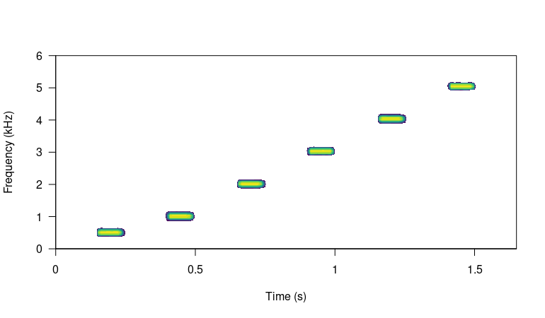
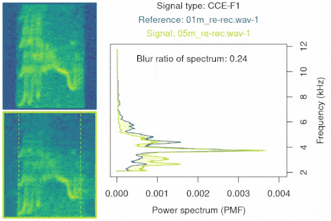

<!-- <script> -->
<!--    $(document).ready(function() { -->
<!--      $head = $('#header'); -->
<!--      $head.prepend('') -->
<!--    }); -->
<!-- </script> -->

<!-- &nbsp;  -->


<!-- <center></center> -->
</center>

&nbsp; 

```{r eval= TRUE, echo=FALSE}

library(knitr)
opts_chunk$set(tidy = TRUE, fig.align = "center", message = FALSE, warning = FALSE)
```


The [baRulho](https://cran.r-project.org/package=baRulho) package is intended to facilitate acoustic analysis of (animal) sound transmission experiments. Such studies typically aim to quantify changes in signal structure when transmitted in a given habitat by broadcasting and re-recording animal sounds at increasing distances. We will refer to these changes in signal structure 'degradation' for the sake of simplicity. The package offers a workflow with functions to prepare the data set for analysis as well as to calculate and visualize several degradation metrics. [baRulho](https://marce10.github.io/baRulho/) builds upon functions and data formats from the [warbleR](https://cran.r-project.org/package=warbleR) and [seewave](https://cran.r-project.org/package=seewave) packages, so some experience with these packages is advised.

The main features of the package are:

 - The use of loops to apply tasks through sounds referenced in a selection table (sensu [warbleR](https://cran.r-project.org/package=warbleR))
 - The production of image files with graphic representations of sound in time and/or frequency that let users verify acoustic analyses 
 - The use of annotation tables as the object format to input acoustic data and annotations and to output results 
 - The use of parallelization to distribute tasks among several cores to improve computational efficiency

The package can be install/load from CRAN as follows:

```{r, eval = FALSE}

# From CRAN would be
install.packages("baRulho")

# load package
library(baRulho)
```

&nbsp;

To install the latest developmental version from [github](https://github.com/) you will need the R package [remotes](https://cran.r-project.org/package=remote):

```{r, eval = FALSE}

# From github
remotes::install_github("maRce10/baRulho")

# load package
library(baRulho)

# also set a working directory, for this example we will use a temporary directory
td <- tempdir()
```

```{r, eval = TRUE, echo = FALSE, message=FALSE}

# global option chunks
knitr::opts_chunk$set(dpi = 70, fig.width = 8, fig.height = 6)

# load package
library(baRulho)
library(kableExtra)

# also set a working directory, for this example we will use a temporary directory
td <- tempdir()
```

&nbsp;

For this vignette we will also need a few more packages:

```{r load packages, eval=TRUE, echo=TRUE, warning=FALSE, message=FALSE}

library(warbleR)
library(ggplot2)
library(viridis)
```

&nbsp;

### Inputting acoustic data and annotations

The package requires the annotation data to be input as a data frame, selection table or extended selection tables. If a data frame is used it must contain the following columns: 1) "sound.files": name of the .wav files, 2) "selec": unique annotation identifier (within a sound file), 3) "start": start time and 4) "end": end time of annotation, 5) 'top.freq': top frequency (for bandpass) and  6) 'bottom.freq' and bottom frequency (for bandpass) of the annotation. A selection table is an objects class from the package [warbleR](https://cran.r-project.org/package=warbleR) that contain annotation data (i.e. time-frequency position of sounds in sound files) that has been previously double-checked. An extended selection table is an object class (also from [warbleR](https://cran.r-project.org/package=warbleR)) that contains both the annotations and the corresponding acoustic data as wave objects. Therefore, extended selection tables are **self-contained objects** since the original sound files are no longer needed to perform acoustic analyses. These objects are created by the `selection_table()` function from [warbleR](https://cran.r-project.org/package=warbleR). Take a look at the [intro to warbleR vignette](https://cran.r-project.org/package=warbleR/vignettes/Intro_to_warbleR.html) for more details. Selection tables and extended selection tables are recommended as they apply a double-checking step on the acoustic data during creation, which helps avoiding downstream errors during analysis. Analysis on extended selection tables also run faster than in the other object classes.

<div class="alert alert-info">

<font size="5">Glossary</font> 

-**Model sound**: sound in which transmission properties will be studied, usually found in the original field recordings or synthetic sound files.

-**Reference sound**: sound to use as a pattern to compare against. Usually created by re-recording a model sound broadcast at 1 m from the source (speaker).

-**Sound ID**: ID of sounds used to identify counterparts across distances. Each sound must have a unique ID within a distance.

-**Ambient noise**: energy from background sounds in the recording, excluding sounds of interest.  

-**Test sound**: sounds re-recorded far from the source to test for transmission/degradation (also refer to as 're-recorded' sounds).

-**Degradation**: term used to describe any changes in the structure of a sound when transmitted in a given habitat (note that there is no agreement on this terminology in the scientific community).

</div>

&nbsp;

--- 

# Workflow of sound processing and analysis

A common sequence of steps to experimentally test hypotheses related to sound transmission is depicted in the following diagram:

 <center></center>

&nbsp;

[baRulho](https://marce10.github.io/baRulho/) offers functions for critical steps in this workflow (those in black, including 'checks') that required acoustic data manipulation and analysis. Additional functions from [warbleR](https://cran.r-project.org/package=warbleR) can be used (and are used in this vignette) to complement functions in [baRulho](https://marce10.github.io/baRulho/). All these tools will be presented following the above workflow.

&nbsp;


# Synthesize sounds

We often want to figure out how transmission properties vary across a range of frequencies.
For instance, Tobias et al (2010) studied whether acoustic adaptation (a special case of sensory drive; Morton 1975), could explain song evolution in Amazonian avian communities.  To test this the authors created synthetic pure tone sounds that were used as playback and re-recorded in different habitats. This is the actual procedure of creating synthetic sounds as they described it: 

> "Tones were synthesized at six different frequencies (0.5, 1.0, 2.0, 3.0, 4.0, and 5.0 kHz) to encompass the range of maximum avian auditory sensitivity (Dooling 1982). At each frequency, we generated two sequences of two 100-msec tones. One sequence had  a  relatively  short  interval  of  150  msec,  close  to  the  mean internote interval in our sample (152± 4 msec). The other sequence had a longer interval of 250 msec, close to the mean maximum internote interval in our sample (283± 74 msec). The first sequence reflects a fast-paced song and the second a slower paced song  (sensu  Slabbekoorn  et  al.  2007).  The  master  file  (44100 Hz/16 bit WAV) thereby consisted of a series of 12 pairs of artificial 100-ms constant-frequency tones at six different frequencies (0.5, 1.0, 2.0, 3.0, 4.0, and 5.0 kHz)." 

We can synthesize the same pure tones using the function `sim_songs()` from the package [warbleR](https://cran.r-project.org/package=warbleR). The function requires 1) the number of tones to synthesize (argument `n`), 2) the duration of the tones (`durs`, in seconds), 3) the duration of the intervals (`gaps`, in seconds) and 4) the frequencies for each tone to be synthesized (`freqs`, in kHz). In addition, the argument `diff.fun` should be set to "pure.tone" and the argument `harm` to 1 to remove harmonics. In our case we need six tones of 100 ms at 0.5, 1, 2, 3, 4, and 5 kHz separated by intervals of 150 ms (at least for the first synthetic file described in Tobias et al 2010). We can also get a selection table (sensu [warbleR](https://cran.r-project.org/package=warbleR)) with the information about the time and frequency location of every sound. This would be required in order to make the master sound file. To get the selection table we need to set the argument `selec.table = TRUE`. This can be done as follows:


```{r, eval = FALSE}

# synthesize
synth.l <- sim_songs(
  n = 6, durs = 0.1, freqs = c(0.5, 1:5), harms = 1, gaps = 0.15,
  diff.fun = "pure.tone", selec.table = TRUE, path = td
)

# plot spectro
seewave::spectro(synth.l$wave,
  scale = FALSE, palette = viridis,
  grid = FALSE, flim = c(0, 6), collevels = seq(-20, 0, 1)
)
```

```{r, eval=TRUE, echo=FALSE}
# synthesize
synth.l <- sim_songs(
  n = 6, durs = 0.1, freqs = c(0.5, 1:5), harms = 1, gaps = 0.15,
  diff.fun = "pure.tone", selec.table = TRUE, path = td
)
```


 


&nbsp;

The function returns a list in which the first element is the selection table and the second one the wave object:

```{r, eval = TRUE}

class(synth.l)
```

```{r, eval = TRUE}

names(synth.l)
```

```{r, eval = FALSE}

synth.l$selec.table
```

```{r, eval = TRUE, echo = FALSE, results='asis'}

kbl <- kable(synth.l$selec.table, align = "c", row.names = F, format = "html", escape = F)

kbl <- kable_styling(kbl, bootstrap_options = "striped", font_size = 14)

print(kbl)
```

&nbsp;

The function also saves the associated '.wav' file in the working directory (in this example `tempdir()`). 

```{r}

list.files(path = td, pattern = "\\.wav$")
```

&nbsp;

# Create master sound file for playback

The function `master_sound_file()` creates a master sound file (as you probably guessed) for playback experiments. The function takes wave objects from an data frame or (extended) selection table containing the model sounds and concatenates them in a single sound file (with some silence in between sounds which length can be modified). `master_sound_file()` adds acoustic markers at the start and end of the playback that can be used to time-sync re-recorded sounds, which streamlines quantification of acoustic degradation. 
The following example shows how to create a master sound file using the synthetic sounds generated above. For the synthetic sounds we need to add a little space between the top and bottom frequency because `sim_songs()` make those values exactly the same for pure tones: 

```{r, eval = FALSE, echo = TRUE}

# extract selection table
st <- synth.l$selec.table

# add freq range (0.5 kHz)
st$bottom.freq <- st$bottom.freq - 0.25
st$top.freq <- st$top.freq + 0.25

# make an extended selection table
synth.est <- selection_table(
  X = st, extended = TRUE,
  confirm.extended = FALSE, path = td
)

# create master sound file
synth_master_annotations <- master_sound_file(
  X = synth.est, file.name = "synthetic_master",
  dest.path = td, gap.duration = 0.15
)
```

&nbsp;

The function saves the master sound file as a wave file and returns a selection table in the R environment with the time and frequency 'coordinates' of the sounds in that file. We can look at the spectrogram of the output file using the [warbleR](https://cran.r-project.org/package=warbleR) function `spectrograms()` as follows:

```{r, eval=FALSE, echo=TRUE}

# plot spectro (saved in working directory)
spectrograms(synth_master_annotations,
  path = td, by.song = "sound.files",
  xl = 3, collevels = seq(-60, 0, 5), osci = TRUE
)
```

 

The function can also create a master sound file from sounds from different sounds files, as is likely the case with recordings collected in the field. The following example shows how to create a master sound file using several sound files. The code uses the example data and recordings from the package [warbleR](https://cran.r-project.org/package=warbleR):

```{r, eval = FALSE, echo = TRUE}

# load example data from warbleR
data(list = c(
  "Phae.long1", "Phae.long2", "Phae.long3", "Phae.long4",
  "lbh_selec_table"
))

# save sound files to temporary folder
writeWave(Phae.long1, file.path(td, "Phae.long1.wav"))
writeWave(Phae.long2, file.path(td, "Phae.long2.wav"))
writeWave(Phae.long3, file.path(td, "Phae.long3.wav"))
writeWave(Phae.long4, file.path(td, "Phae.long4.wav"))

# make an extended selection table
est <- selection_table(
  X = lbh_selec_table, extended = TRUE, confirm.extended = FALSE,
  path = td
)

# create master sound file
master_annotations <- master_sound_file(
  X = est, file.name = "example_master",
  dest.path = td, gap.duration = 0.3
)
```

&nbsp;

Again, we can look at the spectrogram of the output file:

```{r, eval=FALSE, echo=TRUE}

spectrograms(master_annotations,
  path = td, by.song = "sound.files",
  xl = 3, collevels = seq(-60, 0, 5), osci = TRUE
)
```


 

Note that the output could also be exported to [Raven sound analysis software](https://ravensoundsoftware.com/software/raven-pro) ([Cornell Lab of Ornithology](https://www.birds.cornell.edu/home)) for visualization or further manipulation using the function `exp_raven()` from the [Rraven](https://cran.r-project.org/package=Rraven) package. `exp_raven()` exports selections in the R environment to a '.txt' file that can be read in Raven:
 

```{r, eval = FALSE}

Rraven::exp_raven(master_annotations, path = td, file.name = "example_master_selection_table")
```

&nbsp;

Both sound files and annotations can be visualized in Raven ( acoustic analysis software):

 

&nbsp;

Take a look at the [Rraven vignette](https://CRAN.R-project.org/package=Rraven/vignettes/Rraven.html) for more details on how to export data from R to Raven. 

Note that the start and end markers are placed at relatively low amplitudes so they are less affected by degradation. The frequency range of markers can be set with argument `flim`. The relative amplitude of markers can also be adjusted with the `amp.marker` argument. Amplitude of markers will be multiplied by the value supplied so markers will be louder than sounds. These two features should increases the chances of being "detected" at further distances regardless of the amplitude of sounds. 

# Time sync re-recorded sounds

Once we went to the field (or lab) and re-recorded the master sound files at different distances, we are ready to start with data analysis. The first step for getting the data ready for analysis involves finding sounds within the re-recorded sound files. We only need to align the start marker between the master playback and the re-recorded sound files, based on the fact that the time difference between the marker and the sounds should be the same in both cases:


 <center></center>

&nbsp;

We will use example files from a degradation experiment that are hosted in [this repository](). The following code download a zip file with all the data (sound files + annotations) into a temporary working directory and unzip it into a folder called "degrad_exp_files":    

```{r, eval = TRUE}

download.file(
  "https://figshare.com/ndownloader/files/41778951",
  destfile = file.path(tempdir(), "degrad_exp_files.zip"),
  method = "wget"
)

# folder to save files (you can change it to you preference)
td <- file.path(tempdir(), "degrad_exp_files")

unzip(file.path(tempdir(), "degrad_exp_files.zip"),
  exdir = td
)
```


These are the files contained in the data set:

```{r}
list.files(td)
```

&nbsp;

Their names are self-explanatory: a master sound file ("master.wav") and its annotations ("master_annotations.csv"), a reference sound file ("reference_1m.wav") and two test files ("test_10m.wav" and "test_20m.wav") re-recorded at 10 and 20 m respectively.

```{r DELETE, eval = FALSE, echo = FALSE}

# read master
exmp.master <- readWave(file.path(td, "example_master.wav"))

# add 1 s silence and create first copy
exmp.test1 <- addsilw(wave = exmp.master, at = "start", d = 1, output = "Wave", f = exmp.master@samp.rate)

# add 2 s silence and create second copy
exmp.test2 <- addsilw(wave = exmp.master, at = "start", d = 2, output = "Wave", f = exmp.master@samp.rate)

# make noise
ns <- noisew(f = exmp.master@samp.rate, d = duration(exmp.test2) + 1, output = "Wave")

# make noise exactly the same length and add noise to 2 examples
exmp.test1@left <- exmp.test1@left + (ns@left[1:length(exmp.test1@left)] * 150)
exmp.test2@left <- exmp.test2@left + (ns@left[1:length(exmp.test2@left)] * 150)

# normalize both  before saving
exmp.test1 <- normalize(exmp.test1, unit = "16")
exmp.test2 <- normalize(exmp.test2, unit = "16")

# save simulated re-recorded sound files
writeWave(object = exmp.test1, filename = file.path(td, "example_test1.wav"), extensible = FALSE)

writeWave(object = exmp.test2, filename = file.path(td, "example_test2.wav"), extensible = FALSE)
```

&nbsp;

To find the location of the start marker on the test sound files we use the functions `find_markers()` to run a cross-correlation of one or more markers across the test files in order to determine the exact time in which each marker is found: 

```{r, eval = FALSE}

master_annotations <-
  read.csv(file.path(td, "master_annotations.csv"))

markers_position <- find_markers(X = master_annotations, path = td)

markers_position
```

```{r, eval = TRUE, echo=FALSE, results='asis'}

master_annotations <- read.csv(file.path(td, "master_annotations.csv"))

markers_position <- find_markers(X = master_annotations, path = td)

kbl <- kable(markers_position, align = "c", row.names = F, format = "html", escape = F)

kbl <- kable_styling(kbl, bootstrap_options = "striped", font_size = 14)

kbl
```

&nbsp;

The position of the markers is determined as the highest spectrogram cross-correlation value for each marker using the functions `template_correlator()` and `template_detector` from the package [ohun](https://CRAN.R-project.org/package=ohun). If two or more markers are used the function computes an additional column, 'time.mismatch', that compares the time difference between the two templates in the test-files against that in the master sound file. In a perfect detection the value must be 0. With the time location of acoustic markers we can infer the position of all other sounds in the new recordings. A selection table from re-recorded files can be generated using the function `align_test_files()`:

```{r, eval = TRUE}


aligned_tests <-
  align_test_files(
    X = master_annotations,
    Y = markers_position,
    path = td,
    by.song = TRUE
  )
```

&nbsp;

By default the function returns an `extended_selection_table`  created 'by.song' (see '?selection_table()'), which is the data format that pretty much all [baRulho](https://marce10.github.io/baRulho/) functions take.  

```{r, eval = TRUE}

is_extended_selection_table(aligned_tests)

aligned_tests
```

```{r, eval = TRUE, echo = FALSE}

print(TRUE)
```

```{r, eval = TRUE, echo = FALSE, results='asis'}

kbl <- kable(aligned_tests, align = "c", row.names = F, format = "html", escape = F)

kbl <- kable_styling(kbl, bootstrap_options = "striped", font_size = 14)

kbl <- scroll_box(kbl, width = "800px", height = "300px")
kbl
```
&nbsp;

We can also check the precision of the alignment by looking at the spectrograms:

```{r, eval = FALSE}

spectrograms(aligned_tests, by.song = "sound.files", xl = 3, collevels = seq(-60, 0, 5), dest.path = td, osci = TRUE)
```


 

&nbsp;

 

&nbsp;

Below are some examples from actual test sounds that were re-recorded in the field at 1, 30, 65, and 100 m respectively, and were later aligned using the start marker:

 

&nbsp;


---

### Further aligning

When this process is done manually (or when broadcasting devices add some short delays as the case of some bluetooth transmitters) there could be some small misalignment between the inferred versus the actual start time of re-recorded sounds. This is problematic for quantifying degradation in [baRulho](https://marce10.github.io/baRulho/) (and other sound analysis software) as precise alignment of sound is crucial for the accuracy of downstream measures of sound degradation. 

Misalignment can be fixed with the function `realign_test_sounds()`. This function uses spectrogram cross-correlation to sync the position in time of sounds with regard to a reference sound. `realign_test_sounds()` takes the sound recorded at the closest distance to the source as the reference sound. The function calls [warbleR](https://cran.r-project.org/package=warbleR)'s `cross_correlation()` (just as we did above) internally to align sounds using cross-correlation. 

[baRulho](https://marce10.github.io/baRulho/) comes with an example data set called  `playback_est_unaligned`, which contains sounds in which the time position of sounds is slightly unaligned. We can use this data to show how the function `realign_test_sounds()` works: 

```{r, eval = FALSE}
data("playback_est_unaligned")

# method 1
playback_est_aligned <- realign_test_sounds(X = playback_est_unaligned)
```

The output extended selection table contains the new start and end values after alignment. 

This is how the sounds look before and after being aligned:

```{r, eval = FALSE}

# rename sound files so aligned and unaligned sounds are intercalated
unalg <- rename_waves_est(playback_est_unaligned, playback_est_unaligned$sound.files, new.selec = seq(1, 200, by = 2)[1:nrow(playback_est_unaligned)])
alg <- rename_waves_est(playback_est_aligned, playback_est_aligned$sound.files, new.selec = seq(2, 200, by = 2)[1:nrow(playback_est_aligned)])

# add label
unalg$type <- "Before aligning"
alg$type <- "After aligning"

# put together in a single ext sel tab
unalg.alg <- rbind(unalg, alg)

# create spectrograms
spectrograms(unalg.alg[unalg.alg$sound.id != "ambient", ], dest.path = tempdir(), res = 100, wl = 300, title.labels = "type", sel.labels = NULL)
```


<center></center>

&nbsp;

In case this doesn't work as expected there is a plan B. The function `seltailor()` from [warbleR](https://cran.r-project.org/package=warbleR) allows user to manually adjust the start and end of sounds in a extended selection table.

&nbsp;

# Quantifying sound degradation

Most [baRulho](https://marce10.github.io/baRulho/) functions are design to quantify sound degradation. There are a few important things to keep in mind about functions for quantifying degradation:

- The package currently assumes that all recordings have been made with the same equipment and recording volume. This will be modified in future versions to allow for amplitude calibration of recordings.
- Wave envelope and frequency spectrum calculations are made after applying a bandpass filter within the frequency range of the reference sound ('bottom.freq' and 'top.freq' columns)
- The package offers two methods to compare sounds to the reference: 
    1. Compare all sounds with the counterpart that was recorded at the closest distance to source (e.g. compare a sound recorded at 5m, 10m and 15m with its counterpart recorded at 1m). This is the default method.
    1. Compare all sounds with the counterpart recorded at the distance immediately before (e.g. a sound recorded at 10m compared with the one recorded at 5m, then sound recorded at 15m compared with the one recorded at 10m and so on).


## Required data structure

The input data should contain some additional information. [baRulho](https://marce10.github.io/baRulho/) comes with an example `extended_selection_table` data set that can be used to understand the required data structure:
s
```{r,eval=FALSE}

data("playback_est")

playback_est
```


```{r, eval = TRUE, echo = FALSE}

data("playback_est")

kbl <- kable(playback_est, align = "c", row.names = F, format = "html", escape = F)

kbl <- column_spec(kbl, 7:8, background = "#ccebff", bold = TRUE)

kbl <- kable_styling(kbl, bootstrap_options = "striped", font_size = 12)

kbl <- scroll_box(kbl, height = "400px")

kbl
```
&nbsp;
 
 Note that besides the basic acoustic annotation information (e.g. sound file, time, frequency) the table also contains a **'sound.id' column, which contains the ID of sounds used to identify correspondent sounds across distances**, and a **'distance' column that refers to the distance from the source at which each sound was recorded**. Sound ID and distance are required for the comparison of sounds. Also note that some selections are labeled as "ambient" in the 'sound.id'. These selections refer to ambient (background) noise. Ambient noise can be used by some functions to correct for amplitude differences due to non-target sounds.
 
In this example data there are 4 recordings at increasing distances: 1m, 5m, 10m and 15m:

```{r,eval=TRUE}

# count selection per recordings
unique(playback_est$sound.files)
```

The data contains selections for 5 sounds as well as 2 ambient noise selections at each distance/recording:

```{r, eval = FALSE}

table(playback_est$sound.id, playback_est$distance)
```

```{r, eval = TRUE, echo=FALSE}

tb <- table(playback_est$sound.id, playback_est$distance)

kbl <- kable(tb, align = "c", row.names = TRUE, format = "html", escape = F)

kbl <- kable_styling(kbl, bootstrap_options = "striped", font_size = 12)

kbl
```


## Degradation measurements  

### Blur ratio
 
Blur ratio quantifies the degradation of sound as a function of the distortion of the amplitude envelope (time domain) while excluding changes due to energy attenuation. This measure was first described by Dabelsteen et al. (1993). Blur ratio is measured as the mismatch between amplitude envelopes (expressed as probability density functions) of the reference sound and the re-recorded sound. Low values indicate low degradation of sounds.  The function `blur_ratio()` measures the blur ratio of sounds in which a reference playback has been re-recorded at different distances. The function compares each sound to the corresponding reference sound within the supplied frequency range (e.g. bandpass) of the reference sound ('bottom.freq' and 'top.freq' columns in 'X'). The 'sound.id' column must be used to tell the function to only compare sounds belonging to the same category (e.g. song-types). All sound files (or wave objects in the extended selection table) must have the same sampling rate so the length of envelopes is comparable.
Blur ratio can be calculated as follows:

```{r, eval = FALSE}

# run blur ratio
br <- blur_ratio(playback_est, method = 1)

# check output class
is_extended_selection_table(br)
```

```{r, eval = TRUE, echo = FALSE}

# run blur ratio
br <- blur_ratio(playback_est, method = 1, img = FALSE, pb = FALSE)

# check output class
is_extended_selection_table(br)
```

```{r, eval = FALSE}

# see output
br
```

```{r, echo = FALSE}

kbl <- kable(br, align = "c", row.names = F, format = "html", escape = F)

kbl <- column_spec(kbl, 9:10, background = "#ccebff", bold = TRUE)

kbl <- kable_styling(kbl, bootstrap_options = "striped", font_size = 10)

kbl <- scroll_box(kbl, height = "400px")

kbl
```
&nbsp;

The output data frame is similar to input data, except that it includes two new columns ('reference' and 'blur.ratio') with the reference sound and blur ratio values. Note that `NAs` are returned for sounds used as reference and 'ambient' noise selections.

If `img = TRUE` it also returns 1 image file (in 'jpeg' format) for each comparison showing spectrograms of both sounds and the overlaid amplitude envelopes (as probability mass functions (PMF)). 

```{r, eval = FALSE}

# run blur ratio
br <- blur_ratio(playback_est, method = 1, img = TRUE, ssmooth = 300, dest.path = td)
```

```{r, eval = FALSE, echo = FALSE}

sbr <- blur_ratio(playback_est, method = 1, img = TRUE, dest.path = tempdir(), pb = FALSE)

# make the gif here
# https://ezgif.com
```

Output image files (in the working directory) look like these ones:

<center></center>

&nbsp;

The image shows the spectrogram for the reference and re-recorded sound, as well as the envelopes of both sounds overlaid in a single graph. Colors indicate to which sound spectrograms and envelopes belong to. The blur ratio value is also displayed.

The function can also return the amplitude spectrum contours when the argument `envelopes = TRUE`. The contours can be directly input into ggplot to visualize amplitude envelopes, and how they vary with distance and across sound types (and ambient noise if included):

```{r}

# get envelopes
br <- blur_ratio(X = playback_est, envelopes = TRUE)
envs <- attributes(br)$envelopes

# make distance a factor for plotting
envs$distance <- as.factor(envs$distance)

# plot
ggplot(envs, aes(x= time, y = amp, col = distance)) +
geom_line() + facet_wrap(~ sound.id) +
scale_color_manual(values = viridis::viridis(4)) +
labs(x = "Time (s)", y = "Amplitude (PMF)") +
theme_classic()

```

Note than the `smooth` argument could change envelope shapes and related measurements. The following code sets `smooth = 800`:

```{r}

# get envelopes
br <- blur_ratio(X = playback_est, envelopes = TRUE)
envs <- attributes(br)$envelopes

envs$distance <- as.factor(envs$distance)

ggplot(envs, aes(x = time, y = amp, col = distance)) +
  geom_line() +
  facet_wrap(~sound.id) +
  scale_color_viridis_d(alpha = 0.7) +
  labs(x = "Time (s)", y = "Amplitude (PMF)") +
  theme_classic()
```

&nbsp;

### Spectrum blur ratio
 
Spectrum blur ratio (measured by `spectrum_blur_ratio()`) quantifies the degradation of sound as a function of the change in sound energy across the frequency domain, analogous to the blur ratio described above for the time domain (and implemented in `blur_ratio()`). Low values also indicate low degradation of sounds. Spectrum blur ratio is measured as the mismatch between power spectra (expressed as probability density functions) of the reference sound and the re-recorded sound. It works in the same way than `blur_ratio()`, comparing each sound to the corresponding reference sound, and the output and images are alike as well.

Spectrum blur ratio can be calculated as follows:

```{r, eval = FALSE}

# run Spectrum blur ratio
sbr <- spectrum_blur_ratio(playback_est, method = 1, img = TRUE, dest.path = td)

# check output class
is_extended_selection_table(sbr)
```

```{r, eval = TRUE, echo = FALSE}

# run Spectrum blur ratio
sbr <- spectrum_blur_ratio(playback_est, method = 1, pb = FALSE)

# check output class
is_extended_selection_table(sbr)
```

```{r, eval = FALSE, echo = FALSE}

sbr <- spectrum_blur_ratio(playback_est, method = 1, img = TRUE, dest.path = tempdir())

# make the gif here
# https://ezgif.com
```


```{r, eval = FALSE}

# see output
sbr
```

```{r, echo = FALSE}

kbl <- kable(sbr, align = "c", row.names = F, format = "html", escape = F)

kbl <- column_spec(kbl, 9:10, background = "#ccebff", bold = TRUE)

kbl <- kable_styling(kbl, bootstrap_options = "striped", font_size = 10)

kbl <- scroll_box(kbl, height = "400px")

kbl
```
&nbsp;

<center></center>

&nbsp;

As in `blur_ratio()`, `spectrum_blur_ratio()` can also return the amplitude spectrum contours with the argument `spectra = TRUE`:

```{r}
sbr <- spectrum_blur_ratio(X = playback_est, spectra = TRUE)

spctr <- attributes(sbr)$spectra

spctr$distance <- as.factor(spctr$distance)

ggplot(spctr[spctr$freq > 0.3, ], aes(y = amp, x = freq, col = distance)) +
  geom_line() +
  facet_wrap(~sound.id) +
  scale_color_viridis_d(alpha = 0.7) +
  labs(x = "Frequency (kHz)", y = "Amplitude (PMF)") +
  coord_flip() +
  theme_classic()

```

We can also zoom in to the frequency range of the sounds by subsetting the spectrum data:

```{r}

# get the frequencies higher than lowest bottom but lower than highest top freq
spctr <- spctr[spctr$freq > min(playback_est$bottom.freq) & spctr$freq < max(playback_est$top.freq), ]

ggplot(spctr, aes(y = amp, x = freq, col = distance)) +
  geom_line() +
  facet_wrap(~sound.id) +
  scale_color_viridis_d(alpha = 0.7) +
  labs(x = "Frequency (kHz)", y = "Amplitude (PMF)") +
  coord_flip() +
  theme_classic()
```
&nbsp;

### Excess attenuation

With every doubling of distance, sounds attenuate with a 6 dB loss of amplitude (Morton, 1975; Marten & Marler, 1977). Any additional loss of amplitude results in excess attenuation, or energy loss in excess of that expected to occur with distance via spherical spreading, due to atmospheric conditions or habitat (Wiley & Richards, 1978). This degradation metric can be measured using the `excess_attenuation()` function. Low values indicate little sound attenuation. The function will then compare each sound to the corresponding reference sound within the frequency range (e.g. bandpass) of the reference sound ('bottom.freq' and 'top.freq' columns in 'X'). Two methods for calculating excess attenuation are provided (see 'method' argument).

`excess_attenuation()`  can be measured like this:

```{r, eval = TRUE}

# run  envelope correlation
ea <- excess_attenuation(playback_est, method = 1, pb = FALSE)

# check output class
is_extended_selection_table(ea)
```


The output, similar to those of other functions, is an extended selection table with the input data, but also including two new columns ('reference' and  'excess.attenuation') with the reference sound and the excess attenuation:

```{r, eval = FALSE}
# print output
ea
```

```{r, echo = FALSE}

kbl <- kable(ea, align = "c", row.names = F, format = "html", escape = F)

kbl <- column_spec(kbl, 9:10, background = "#ccebff", bold = TRUE)

kbl <- kable_styling(kbl, bootstrap_options = "striped", font_size = 10)

kbl <- scroll_box(kbl, height = "400px")

kbl
```

&nbsp;

### Envelope correlation

Amplitude envelope correlation measures the similarity of two sounds in the time domain. The `envelope_correlation()` function measures the envelope correlation coefficients between reference playback and re-recorded sounds. Values close to 1 means very similar amplitude envelopes (i.e. little degradation has occurred). If envelopes have different lengths (that is when sounds have different lengths) cross-correlation is applied and the maximum correlation coefficient is returned. Cross-correlation is achieved by sliding the shortest sound along the largest one and calculating the correlation at each step. As in the functions detailed above, 'sound.id' column must be used to instruct the function to only compare sounds that belong to the same category.

`envelope_correlation()` can be run as follows:

```{r, eval = TRUE}

# run  envelope correlation
ec <- envelope_correlation(playback_est, method = 1, pb = FALSE)

# check output class
is_extended_selection_table(ec)
```

The output is also similar to those of other functions; an extended selection table similar to input data, but also includes two new columns ('reference' and  'envelope.correlation')
with the reference sound and the amplitude envelope correlation coefficients:

```{r, eval = FALSE}
# print output
ec
```

```{r, echo = FALSE}

kbl <- kable(ec, align = "c", row.names = F, format = "html", escape = F)

kbl <- column_spec(kbl, 9:10, background = "#ccebff", bold = TRUE)

kbl <- kable_styling(kbl, bootstrap_options = "striped", font_size = 10)

kbl <- scroll_box(kbl, height = "400px")

kbl
```

&nbsp;

Note that this function doesn't provide a graphical output. However, the graphs generated by `blur_ratio()` can be used to inspect the envelope shapes and the alignment of sounds.

### Spectrum correlation

Spectrum correlation measures the similarity of two sounds in the frequency domain. This is similar to `envelope_correlation()`, but in the frequency domain. Both sounds are compared within the frequency range of the reference sound (so both spectra have the same length). Again, values near 1 indicate identical frequency spectrum  (i.e. no degradation). 

```{r, eval = TRUE}

# run spectrum correlation
sc <- spectrum_correlation(playback_est, method = 1, pb = FALSE)

# check output class
is_extended_selection_table(sc)
```

The output is also similar to that of `envelope_correlation()`:

```{r, eval = FALSE}
# print output
sc
```

```{r, echo = FALSE}

kbl <- kable(sc, align = "c", row.names = F, format = "html", escape = F)

kbl <- column_spec(kbl, 9:10, background = "#ccebff", bold = TRUE)

kbl <- kable_styling(kbl, bootstrap_options = "striped", font_size = 10)

kbl <- scroll_box(kbl, height = "400px")

kbl
```

&nbsp;

As in `envelope_correlation()`, `spectrum_correlation()` doesn't provide a graphical output. However, the graphs generated by `spectrum_blur_ratio()` can also be used to inspect the spectrum shapes and the sound alignment.

### Signal-to-noise ratio

Signal-to-noise ratio (SNR) quantifies sound amplitude level in relation to ambient noise as a metric of overall sound attenuation. Therefore, attenuation refers to the loss of energy as described by Dabelsteen et al (1993). This method is implemented in the function `signal_to_noise_ratio()`. The function requires a measurement of ambient noise, which could either be the noise right before each sound (`noise.ref = "adjacent"`) or one or more ambient noise measurements per recording (`noise.ref = "custom"`). For the latter, selections on sound parameters in which ambient noise will be measured must be specified. Alternatively, one or more selections of ambient noise can be used as reference (see 'noise.ref' argument). This can potentially provide a more accurate representation of ambient noise. When margins overlap with another acoustic signal nearby, SNR will be inaccurate, so margin length should be carefully considered. Any SNR less than or equal to one suggests background noise is equal to or overpowering the acoustic signal. SNR can be measured as follows:

```{r, eval = TRUE}

# run signal to noise ratio
sa <- signal_to_noise_ratio(playback_est, pb = FALSE, noise.ref = "custom")

# check output class
is_extended_selection_table(sa)
```

The output is also similar to the other functions:

```{r, eval = FALSE}
# print output
sa
```

```{r, echo = FALSE}


kbl <- kable(sa, align = "c", row.names = F, format = "html", escape = F)

kbl <- column_spec(kbl, 9, background = "#ccebff", bold = TRUE)

kbl <- kable_styling(kbl, bootstrap_options = "striped", font_size = 10)

kbl <- scroll_box(kbl, height = "400px")

kbl
```

&nbsp;

Note that this function does not compare sounds to references, so no reference column is added.

### Tail-to-signal ratio

Tail-to-signal ratio (TSR) is used to quantify reverberations. Specifically TSR measures the ratio of energy in the reverberation tail  (the time segment right after the sound) to energy in the sound. A general margin in which reverberation tail will be measured must be specified. The function will measure TSR within the supplied frequency range (e.g. bandpass) of the reference sound ('bottom.freq' and 'top.freq' columns in 'X'). Two methods for calculating reverberations are provided (see 'type' argument). `Type 1` is based on the original description of TSR in Dabelsteen et al. (1993) while `type 2` is better referred to as "tail-to-noise ratio", given that it compares the amplitude of tails to those of ambient noise. For both types higher values represent more reverberations. TSR can be measured as follows:

```{r, eval = TRUE}

# run tail to signal ratio
tsr <- tail_to_signal_ratio(playback_est,
  pb = FALSE,
  type = 1, mar = 0.05
)

# check output class
is_extended_selection_table(tsr)
```

Again, the output is similar to other functions:

```{r, eval = FALSE}
# print output

tsr
```

```{r, echo = FALSE}


kbl <- kable(tsr, align = "c", row.names = F, format = "html", escape = F)

kbl <- column_spec(kbl, 9, background = "#ccebff", bold = TRUE)

kbl <- kable_styling(kbl, bootstrap_options = "striped", font_size = 10)

kbl <- scroll_box(kbl, height = "400px")

kbl
```

&nbsp;

### Spectrogram distortion

Finally, the function `spcc()` measures spectrogram cross-correlation as a metric of sound distortion of sounds. Values close to 1 means very similar spectrograms (i.e. little sound distortion). The function is a wrapper on [warbleR](https://cran.r-project.org/package=warbleR)'s `cross_correlation()`. It can be run as follows:

```{r, eval = TRUE}

# run spcc
spd <- spcc(X = playback_est, method = 1, wl = 512, pb = FALSE)

# check output class
is_extended_selection_table(spd)
```

And again, the output is similar to other functions:

```{r, eval = FALSE}
# print output
spd
```

```{r, echo = FALSE}

kbl <- kable(spd, align = "c", row.names = F, format = "html", escape = F)

kbl <- column_spec(kbl, 9:10, background = "#ccebff", bold = TRUE)

kbl <- kable_styling(kbl, bootstrap_options = "striped", font_size = 10)

kbl <- scroll_box(kbl, height = "400px")

kbl
```

&nbsp;

## Other measurements

### Noise profiles

The function `noise_profile()` allows to estimate the frequency spectrum of ambient noise. This can be done on extended selection tables (using the segments containing no sound) or over complete sound files in the working directory (or path supplied). The function uses \code{\link[seewave]{meanspec}} internally to calculate frequency spectra. The following code measures the ambient noise profile for the recordings at distance >= 5m on the example extended selection table:

```{r, eval = TRUE}

# run noise profile
np <- noise_profile(X = playback_est[playback_est$distance > 5, ], mar = 0.05)
```

The output is a data frame with amplitude values for the frequency bins for each wave object in the extended selection table:

```{r, eval = FALSE}
# print output
head(np, 20)
```

```{r, echo = FALSE}

kbl <- kable(np[1:20, ], align = "c", row.names = F, format = "html", escape = F)

kbl <- column_spec(kbl, 2:3, background = "#ccebff", bold = TRUE)

kbl <- kable_styling(kbl, bootstrap_options = "striped", font_size = 10)

kbl <- scroll_box(kbl, height = "400px")

kbl
```

This can be graphically represented as follows:

```{r, eval = TRUE}

ggplot(np, aes(y = amp, x = freq, col = sound.files)) +
  geom_line(linewidth = 1.4) +
  scale_color_viridis_d(begin = 0.2, end = 0.8, alpha = 0.5) +
  labs(x = "Frequency (kHz)", y = "Amplitude (dBA)") +
  coord_flip() +
  theme_classic()
```

The output data is actually an average of several frequency spectra for each sound file. We can obtain the original spectra by setting the argument `averaged = FALSE`: 

```{r, eval = TRUE, warning = FALSE}

np <- noise_profile(
  X = playback_est[playback_est$distance > 5, ],
  mar = 0.1, averaged = FALSE
)

# make a column containing sound file and selection
np$sf.sl <- paste(np$sound.files, np$selec)

ggplot(np, aes(y = amp, x = freq, col = sound.files, group = sf.sl)) +
  geom_line(linewidth = 1.4) +
  scale_color_viridis_d(begin = 0.2, end = 0.8, alpha = 0.5) +
  labs(x = "Frequency (kHz)", y = "Amplitude (dBA)") +
  coord_flip() +
  theme_classic()
```

Note that we can limit the frequency range by using a bandpass filter ('bp' argument). In addition, the argument 'hop.size', which control the size of the time windows, affects the precision in the frequency domain. We can get a better precision by increasing 'hop.size' (or 'wl'):


```{r, eval = TRUE}

np <- noise_profile(
  X = playback_est[playback_est$distance > 5, ],
  mar = 0.05, bp = c(0, 10),
  averaged = FALSE, hop.size = 3
)

# make a column containing sound file and selection
np$sf.sl <- paste(np$sound.files, np$selec)

ggplot(np, aes(y = amp, x = freq, col = sound.files, group = sf.sl)) +
  geom_line(linewidth = 1.4) +
  scale_color_viridis_d(begin = 0.2, end = 0.8, alpha = 0.5) +
  labs(x = "Frequency (kHz)", y = "Amplitude (dBA)") +
  coord_flip() +
  theme_classic()
```


The function can estimate noise profiles for complete sound files, by supplying a list of the files (argument 'files', and not supplying  'X') or by simply running it without supplying 'X' or 'files'. In this case it will run over all sound files in the working directory (or 'path' supplied). 

---

Please report any bugs [here](https://github.com/maRce10/baRulho/issues). 

The package [baRulho](https://marce10.github.io/baRulho/) should be cited as follows:

Araya-Salas, M. (2020), *baRulho: quantifying habitat-induced degradation of (animal) acoustic signals in R*. R package version 1.0.0.

---

# References

1. Araya-Salas, M. (2017). *Rraven: connecting R and Raven bioacoustic software*. R package version 1.0.0.

1.  Araya-Salas, M. (2020), *baRulho: quantifying habitat-induced degradation of (animal) acoustic signals in R*. R package version 1.0.0
  
1. Araya-Salas M, Smith-Vidaurre G. (2017) *warbleR: An R package to streamline analysis of animal acoustic signals*. Methods Ecol Evol 8:184–191.

1. Dabelsteen, T., Larsen, O. N., & Pedersen, S. B. (1993). *Habitat-induced degradation of sound signals: Quantifying the effects of communication sounds and bird location on blur ratio, excess attenuation, and signal-to-noise ratio in blackbird song*. The Journal of the Acoustical Society of America, 93(4), 2206.

1. Marten, K., & Marler, P. (1977). *Sound transmission and its significance for animal vocalization. Behavioral* Ecology and Sociobiology, 2(3), 271-290.

1. Morton, E. S. (1975). *Ecological sources of selection on avian sounds*. The American Naturalist, 109(965), 17-34.

1. Tobias, J. A., Aben, J., Brumfield, R. T., Derryberry, E. P., Halfwerk, W., Slabbekoorn, H., & Seddon, N. (2010). *Song divergence by sensory drive in Amazonian birds*. Evolution, 64(10), 2820-2839.

---

<font size="4">Session information</font>

```{r session info, echo=F}

sessionInfo()
```
