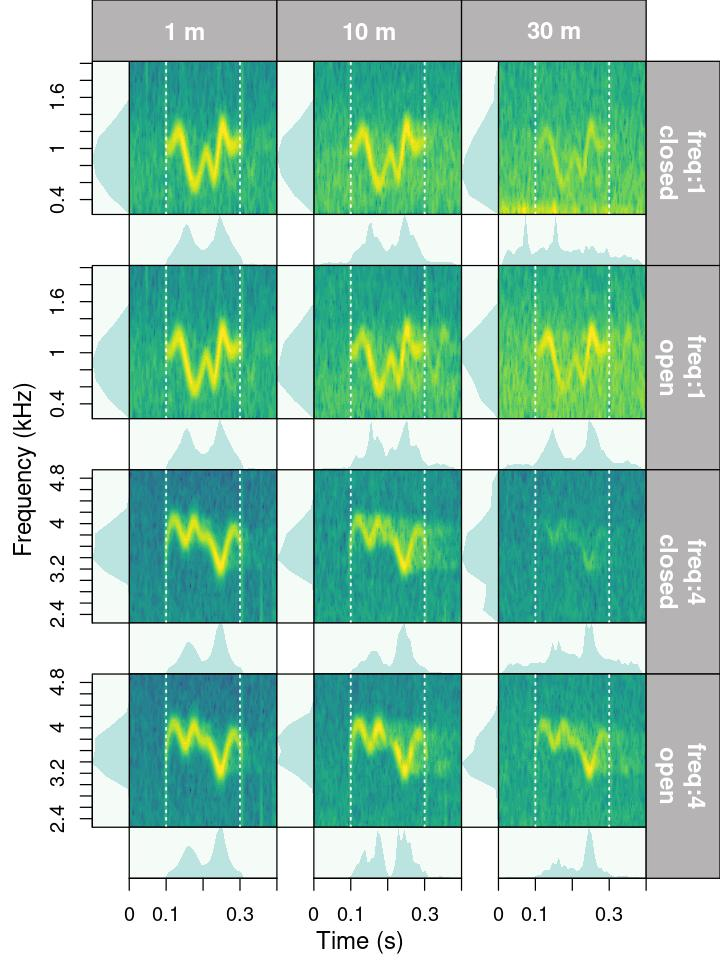
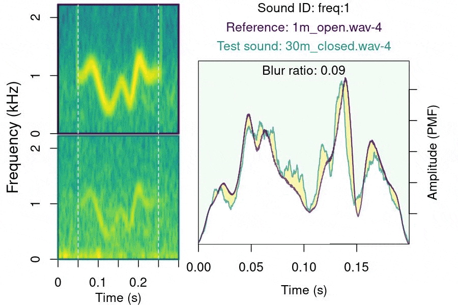

<!-- <script> -->
<!--    $(document).ready(function() { -->
<!--      $head = $('#header'); -->
<!--      $head.prepend('') -->
<!--    }); -->
<!-- </script> -->

<!-- &nbsp;  -->


<!-- <center></center> -->
</center>

&nbsp; 

```{r eval= TRUE, echo=FALSE}


library(knitr)
library(kableExtra)
opts_chunk$set(
  fig.align = "center",
  message = FALSE,
  warning = FALSE
)
```


There are a few important things to keep in mind about functions for quantifying degradation:

- The package currently assumes that all recordings have been made with the same equipment and recording volume. This will be modified in future versions to allow for amplitude calibration of recordings.
- Wave envelope and frequency spectrum calculations are made after applying a bandpass filter within the frequency range of the reference sound ('bottom.freq' and 'top.freq' columns)
- The package offers two methods to compare sounds to the reference: 
    1. Compare all sounds with the counterpart that was recorded at the closest distance to source (e.g. compare a sound recorded at 5m, 10m and 15m with its counterpart recorded at 1m). This is the default method.
    1. Compare all sounds with the counterpart recorded at the distance immediately before (e.g. a sound recorded at 10m compared with the one recorded at 5m, then sound recorded at 15m compared with the one recorded at 10m and so on).
- The package assumes all sound files have the same sampling rate.

## Required data structure

The input data should contain some additional information. [baRulho](https://marce10.github.io/baRulho/) comes with an example `extended_selection_table` data set that can be used to understand the required data structure:
s
```{r,eval=TRUE}

# load packages
library(baRulho)
library(viridis)
library(ggplot2)

# load example data
data("test_sounds_est")

```


```{r, eval = TRUE, echo = FALSE}

kbl <- kable(test_sounds_est, align = "c", row.names = F, format = "html", escape = F)

kbl <- column_spec(kbl, 7:9, background = "#ccebff", bold = TRUE)

kbl <- kable_styling(kbl, bootstrap_options = "striped", font_size = 12)

kbl <- scroll_box(kbl, height = "400px")

kbl
```
&nbsp;
 
Transmission experiments tend to follow a common experimental design in which model sounds are re-recorded at increasing distance within a transect. The structure of the data must indicate the transect and distance within that transect for each sound. Hence, besides the basic acoustic annotation information (e.g. sound file, time, frequency) the table also includes the following columns:

 - **'sound.id': ID of sounds used to identify same sounds at different distances and transects**
 - **'distance': refers to the distance from the source at which each sound was recorded**
 - **'transect' identify sounds (rows) from the same transect**. Each distance is replicated once within a transect.  
 
 
 
Importantly, each sound ID can have only one sample at each distance/transect combination.
The combined information from these columns is used to identify the reference sounds for each test sound. The function `set_reference_sounds()` does exactly that. There are two possible experimental designs when defining reference sounds (which is controlled by the argument 'method' in `set_reference_sounds()`):

- 1: compare sounds (by 'sound.id') with their counterpart that was recorded at the closest distance to source (e.g. compare a sound recorded at 5m, 10m and 15m with its counterpart recorded at 1m). This is the default method. For this design users can have a single example for the shortest distance to be used as reference (for instance at 1m as is the case in most studies) The function will try to use references from the same transect. However, if there is another test sound from the same 'sound.id' at a shorter distance in other transects, it will be used as reference instead. 
- 2: compare all sounds with their counterpart recorded at the distance immediately before within a transect (e.g. a sound recorded at 10m compared with the same sound recorded at 5m, then sound recorded at 15m compared with same sound recorded at 10m and so on).

Also note that some selections are labeled as "ambient" in the 'sound.id'. These selections refer to ambient (background) noise. Ambient noise can be used by some functions to correct for amplitude differences due to non-target sounds.
 
In this example data there are 4 recordings at increasing distances: 1m, 5m, 10m and 15m:

```{r,eval=TRUE}

# count selection per recordings
unique(test_sounds_est$sound.files)

```

The data contains selections for 5 sounds as well as 1 ambient noise selections at each distance/recording:

```{r, eval = FALSE}

table(test_sounds_est$sound.id, test_sounds_est$distance)

```

```{r, eval = TRUE, echo=FALSE}

tb <- table(test_sounds_est$sound.id, test_sounds_est$distance)

kbl <- kable(tb, align = "c", row.names = TRUE, format = "html", escape = F)

kbl <- kable_styling(kbl, bootstrap_options = "striped", font_size = 12)

kbl
```


## Measuring degradation 

### Data format

The functions `set_reference_sounds()` can be used to determined, for each row in the input data, which sounds would be used as references. The function can do this using any of the two methods described above:

```{r}

# add reference column
test_sounds_est <- set_reference_sounds(test_sounds_est, method = 1)

# print
test_sounds_est
```

```{r, echo = FALSE}

kbl <- kable(test_sounds_est, align = "c", row.names = F, format = "html", escape = F)

kbl <- column_spec(kbl, 10, background = "#ccebff", bold = TRUE)

kbl <- kable_styling(kbl, bootstrap_options = "striped", font_size = 10)

kbl <- scroll_box(kbl, height = "400px")

kbl
```
&nbsp;

The function adds the column 'reference' which is then used by downstream functions plotting or measuring degradation. References are indicated as a the combination of the 'sound.files' and 'selec' column. For instance, '10m.wav-1' indicates that the row in which the 'selec' column is '1' and the sound file is '10m.wav' should be used as reference. The function also checks that the information 'X' is in the right format so it wont produce errors in downstream analysis (see 'X' argument description for details on format). The function will ignore rows with 'sound.id' 'ambient', 'start_marker' and 'end_marker'.

### Visual inspection

The function `plot_degradation()` aims to simplify the visual inspection of sound degradation by producing multipanel figures (saved as JPEG files in 'dest.path') containing visualizations of each test sound and its reference. Sounds are sorted by distance (columns) and transect. Visualizations include spectrograms, amplitude envelopes and power spectra (the last 2 are optional):


```{r, eval = FALSE}

# sort to order panels
test_sounds_est <-
  test_sounds_est[order(test_sounds_est$sound.id,
                        test_sounds_est$transect,
                        decreasing = FALSE),]

# create plots
plot_degradation(test_sounds_est, dest.path = tempdir())

```


```{r, echo=FALSE, out.width="60%", fig.align='center'}

```

&nbsp;

Each row includes all the copies of a sound id for a given transect (the row label includes the sound id in the first line and transect in the second line), also including its reference if it comes from another transect. Ambient noise annotations (sound.id 'ambient') are excluded. Before  This is one the plots generated using the example data.

### Blur ratio
 
Blur ratio quantifies the degradation of sound as a function of the distortion of the amplitude envelope (time domain) while excluding changes due to energy attenuation. This measure was first described by Dabelsteen et al. (1993). Blur ratio is measured as the mismatch between amplitude envelopes (expressed as probability density functions) of the reference sound and the re-recorded sound. Low values indicate low degradation of sounds.  The function `blur_ratio()` measures the blur ratio of sounds in which a reference playback has been re-recorded at different distances. The function compares each sound to the corresponding reference sound within the supplied frequency range (e.g. bandpass) of the reference sound ('bottom.freq' and 'top.freq' columns in 'X'). The 'sound.id' column must be used to tell the function to only compare sounds belonging to the same category (e.g. song-types). All sound files (or wave objects in the extended selection table) must have the same sampling rate so the length of envelopes is comparable.
Blur ratio can be calculated as follows:

```{r, eval = FALSE}


# run blur ratio
br <- blur_ratio(X = test_sounds_est)

```

```{r, eval = TRUE, echo = FALSE}

# run blur ratio
br <- blur_ratio(test_sounds_est)

```

```{r, eval = FALSE}

# see output
br
```

```{r, echo = FALSE}

kbl <- kable(br, align = "c", row.names = F, format = "html", escape = F)

kbl <- column_spec(kbl, 11, background = "#ccebff", bold = TRUE)

kbl <- kable_styling(kbl, bootstrap_options = "striped", font_size = 10)

kbl <- scroll_box(kbl, height = "400px")

kbl
```
&nbsp;

The output data frame is simply the input data with an additional column ('blur.ratio') with the  blur ratio values. Note that `NAs` are returned for sounds used as reference and 'ambient' noise selections.

The function `plot_blur_ratio()` can be used to generate image files (in 'jpeg' format) for each comparison showing spectrograms of both sounds and the overlaid amplitude envelopes (as probability mass functions (PMF)). 

```{r, eval = TRUE}

# plot blur ratio
plot_blur_ratio(X = test_sounds_est, dest.path = tempdir())

```

Output image files (in the working directory) look like these ones:

<center></center>

&nbsp;

The image shows the spectrogram for the reference and re-recorded sound, as well as the envelopes of both sounds overlaid in a single graph. Colors indicate to which sound spectrograms and envelopes belong to. The blur ratio value is also displayed.

The function can also return the amplitude spectrum contours when the argument `envelopes = TRUE`. The contours can be directly input into ggplot to visualize amplitude envelopes, and how they vary with distance and across sound types (and ambient noise if included):

```{r}

# get envelopes
br <- blur_ratio(X = test_sounds_est, envelopes = TRUE)
envs <- attributes(br)$envelopes

# make distance a factor for plotting
envs$distance <- as.factor(envs$distance)

# plot
ggplot(envs, aes(x = time, y = amp, col = distance)) +
  geom_line() + facet_wrap( ~ sound.id) +
  scale_color_viridis_d(alpha = 0.7) +
  labs(x = "Time (s)", y = "Amplitude (PMF)") +
  theme_classic()

```

The `env.smooth` argument could change envelope shapes and related measurements. The following code sets `env.smooth = 800` which produces smoother envelopes:

```{r}

# get envelopes
br <- blur_ratio(X = test_sounds_est, envelopes = TRUE, env.smooth = 800)
envs <- attributes(br)$envelopes

envs$distance <- as.factor(envs$distance)

ggplot(envs, aes(x = time, y = amp, col = distance)) +
  geom_line() +
  facet_wrap( ~ sound.id) +
  scale_color_viridis_d(alpha = 0.7) +
  labs(x = "Time (s)", y = "Amplitude (PMF)") +
  theme_classic()
```

&nbsp;

### Spectrum blur ratio
 
Spectrum blur ratio (measured by `spectrum_blur_ratio()`) quantifies the degradation of sound as a function of the change in sound energy across the frequency domain, analogous to the blur ratio described above for the time domain (and implemented in `blur_ratio()`). Low values also indicate low degradation of sounds. Spectrum blur ratio is measured as the mismatch between power spectra (expressed as probability density functions) of the reference sound and the re-recorded sound. It works in the same way than `blur_ratio()`, comparing each sound to the corresponding reference sound, and the output and images are alike as well.

Spectrum blur ratio can be calculated as follows:

```{r, eval = FALSE}

# run Spectrum blur ratio
sbr <- spectrum_blur_ratio(test_sounds_est)

```

```{r, eval = TRUE, echo = FALSE}

# run Spectrum blur ratio
sbr <- spectrum_blur_ratio(test_sounds_est)

```

```{r, eval = FALSE, echo = FALSE}

sbr <- spectrum_blur_ratio(test_sounds_est)

# make the gif here
# https://ezgif.com
```


```{r, eval = FALSE}

# see output
sbr
```

```{r, echo = FALSE}

kbl <- kable(sbr, align = "c", row.names = F, format = "html", escape = F)

kbl <- column_spec(kbl, 11, background = "#ccebff", bold = TRUE)

kbl <- kable_styling(kbl, bootstrap_options = "striped", font_size = 10)

kbl <- scroll_box(kbl, height = "400px")

kbl
```
&nbsp;

As in `blur_ratio()`, `spectrum_blur_ratio()` can also return the amplitude spectrum contours with the argument `spectra = TRUE`:

```{r}
sbr <- spectrum_blur_ratio(X = test_sounds_est, spectra = TRUE)

spctr <- attributes(sbr)$spectra

spctr$distance <- as.factor(spctr$distance)

ggplot(spctr[spctr$freq > 0.3,], aes(y = amp, x = freq, col = distance)) +
  geom_line() +
  facet_wrap( ~ sound.id) +
  scale_color_viridis_d(alpha = 0.7) +
  labs(x = "Frequency (kHz)", y = "Amplitude (PMF)") +
  coord_flip() +
  theme_classic()

```

&nbsp;

### Excess attenuation

With every doubling of distance, sounds attenuate with a 6 dB loss of amplitude (Morton, 1975; Marten & Marler, 1977). Any additional loss of amplitude results in excess attenuation, or energy loss in excess of that expected to occur with distance via spherical spreading, due to atmospheric conditions or habitat (Wiley & Richards, 1978). This degradation metric can be measured using the `excess_attenuation()` function. Low values indicate little sound attenuation. The function will then compare each sound to the corresponding reference sound within the frequency range (e.g. bandpass) of the reference sound ('bottom.freq' and 'top.freq' columns in 'X'). Two methods for calculating excess attenuation are provided (see 'method' argument).

`excess_attenuation()`  can be measured like this:

```{r, eval = TRUE}

# run  envelope correlation
ea <- excess_attenuation(test_sounds_est)

```


The output, similar to those of other functions, is an extended selection table with the input data, but also including two new columns ('reference' and  'excess.attenuation') with the reference sound and the excess attenuation:

```{r, eval = FALSE}
# print output
ea
```

```{r, echo = FALSE}

kbl <- kable(ea, align = "c", row.names = F, format = "html", escape = F)

kbl <- column_spec(kbl, 11, background = "#ccebff", bold = TRUE)

kbl <- kable_styling(kbl, bootstrap_options = "striped", font_size = 10)

kbl <- scroll_box(kbl, height = "400px")

kbl
```

&nbsp;

### Envelope correlation

Amplitude envelope correlation measures the similarity of two sounds in the time domain. The `envelope_correlation()` function measures the envelope correlation coefficients between reference playback and re-recorded sounds. Values close to 1 means very similar amplitude envelopes (i.e. little degradation has occurred). If envelopes have different lengths (that is when sounds have different lengths) cross-correlation is applied and the maximum correlation coefficient is returned. Cross-correlation is achieved by sliding the shortest sound along the largest one and calculating the correlation at each step. As in the functions detailed above, 'sound.id' column must be used to instruct the function to only compare sounds that belong to the same category.

`envelope_correlation()` can be run as follows:

```{r, eval = TRUE}

# run  envelope correlation
ec <- envelope_correlation(test_sounds_est)

```

The output is also similar to those of other functions; an extended selection table similar to input data, but also includes two new columns ('reference' and  'envelope.correlation')
with the reference sound and the amplitude envelope correlation coefficients:

```{r, eval = FALSE}
# print output
ec
```

```{r, echo = FALSE}

kbl <- kable(ec, align = "c", row.names = F, format = "html", escape = F)

kbl <- column_spec(kbl, 11, background = "#ccebff", bold = TRUE)

kbl <- kable_styling(kbl, bootstrap_options = "striped", font_size = 10)

kbl <- scroll_box(kbl, height = "400px")

kbl
```

&nbsp;

Note that this function doesn't provide a graphical output. However, the graphs generated by `blur_ratio()` can be used to inspect the envelope shapes and the alignment of sounds.

### Spectrum correlation

Spectrum correlation measures the similarity of two sounds in the frequency domain. This is similar to `envelope_correlation()`, but in the frequency domain. Both sounds are compared within the frequency range of the reference sound (so both spectra have the same length). Again, values near 1 indicate identical frequency spectrum  (i.e. no degradation). 

```{r, eval = TRUE}

# run spectrum correlation
sc <- spectrum_correlation(test_sounds_est)

```

The output is also similar to that of `envelope_correlation()`:

```{r, eval = FALSE}
# print output
sc
```

```{r, echo = FALSE}

kbl <- kable(sc, align = "c", row.names = F, format = "html", escape = F)

kbl <- column_spec(kbl, 11, background = "#ccebff", bold = TRUE)

kbl <- kable_styling(kbl, bootstrap_options = "striped", font_size = 10)

kbl <- scroll_box(kbl, height = "400px")

kbl
```

&nbsp;

As in `envelope_correlation()`, `spectrum_correlation()` doesn't provide a graphical output. However, the graphs generated by `spectrum_blur_ratio()` can also be used to inspect the spectrum shapes and the sound alignment.

### Signal-to-noise ratio

Signal-to-noise ratio (SNR) quantifies sound amplitude level in relation to ambient noise as a metric of overall sound attenuation. Therefore, attenuation refers to the loss of energy as described by Dabelsteen et al (1993). This method is implemented in the function `signal_to_noise_ratio()`. The function requires a measurement of ambient noise, which could either be the noise right before each sound (`noise.ref = "adjacent"`) or one or more ambient noise measurements per recording (`noise.ref = "custom"`). For the latter, selections on sound parameters in which ambient noise will be measured must be specified. Alternatively, one or more selections of ambient noise can be used as reference (see 'noise.ref' argument). This can potentially provide a more accurate representation of ambient noise. When margins overlap with another acoustic signal nearby, SNR will be inaccurate, so margin length should be carefully considered. Any SNR less than or equal to one suggests background noise is equal to or overpowering the acoustic signal. SNR can be measured as follows:

```{r, eval = TRUE}

# run signal to noise ratio
sa <-
  signal_to_noise_ratio(test_sounds_est,
                        pb = FALSE,
                        noise.ref = "custom",
                        mar = 0.1)

```

The output is also similar to the other functions:

```{r, eval = FALSE}
# print output
sa
```

```{r, echo = FALSE}


kbl <- kable(sa, align = "c", row.names = F, format = "html", escape = F)

kbl <- column_spec(kbl, 9, background = "#ccebff", bold = TRUE)

kbl <- kable_styling(kbl, bootstrap_options = "striped", font_size = 10)

kbl <- scroll_box(kbl, height = "400px")

kbl
```

&nbsp;

Note that this function does not compare sounds to references, so no reference column is added.

### Tail-to-signal ratio

Tail-to-signal ratio (TSR) is used to quantify reverberations. Specifically TSR measures the ratio of energy in the reverberation tail  (the time segment right after the sound) to energy in the sound. A general margin in which reverberation tail will be measured must be specified. The function will measure TSR within the supplied frequency range (e.g. bandpass) of the reference sound ('bottom.freq' and 'top.freq' columns in 'X'). Two methods for calculating reverberations are provided (see 'type' argument). `Type 1` is based on the original description of TSR in Dabelsteen et al. (1993) while `type 2` is better referred to as "tail-to-noise ratio", given that it compares the amplitude of tails to those of ambient noise. For both types higher values represent more reverberations. TSR can be measured as follows:

```{r, eval = TRUE}

# run tail to signal ratio
tsr <- tail_to_signal_ratio(test_sounds_est, type = 1, mar = 0.05)

```

Again, the output is similar to other functions:

```{r, eval = FALSE}
# print output

tsr
```

```{r, echo = FALSE}


kbl <- kable(tsr, align = "c", row.names = F, format = "html", escape = F)

kbl <- column_spec(kbl, 9, background = "#ccebff", bold = TRUE)

kbl <- kable_styling(kbl, bootstrap_options = "striped", font_size = 10)

kbl <- scroll_box(kbl, height = "400px")

kbl
```

&nbsp;

### Spectrogram distortion

Finally, the function `spcc()` measures spectrogram cross-correlation as a metric of sound distortion of sounds. Values close to 1 means very similar spectrograms (i.e. little sound distortion). The function is a wrapper on [warbleR](https://cran.r-project.org/package=warbleR)'s `cross_correlation()`. It can be run as follows:

```{r, eval = TRUE}

# run spcc
spd <- spcc(X = test_sounds_est, wl = 512)

```

And again, the output is similar to other functions:

```{r, eval = FALSE}
# print output
spd
```

```{r, echo = FALSE}

kbl <- kable(spd, align = "c", row.names = F, format = "html", escape = F)

kbl <- column_spec(kbl, 11, background = "#ccebff", bold = TRUE)

kbl <- kable_styling(kbl, bootstrap_options = "striped", font_size = 10)

kbl <- scroll_box(kbl, height = "400px")

kbl
```

&nbsp;

## Other measurements

### Noise profiles

The function `noise_profile()` allows to estimate the frequency spectrum of ambient noise. This can be done on extended selection tables (using the segments containing no sound) or over entire sound files in the working directory (or path supplied). The function uses \code{\link[seewave]{meanspec}} internally to calculate frequency spectra. The following code measures the ambient noise profile for the recordings at distance >= 5m on the example extended selection table:

```{r, eval = TRUE}

# run noise profile
np <-
  noise_profile(X = test_sounds_est[test_sounds_est$distance > 5,], mar = 0.05)
```

The output is a data frame with amplitude values for the frequency bins for each wave object in the extended selection table:

```{r, eval = FALSE}
# print output
head(np, 20)
```

```{r, echo = FALSE}

kbl <- kable(np[1:20, ], align = "c", row.names = F, format = "html", escape = F)

kbl <- column_spec(kbl, 2:3, background = "#ccebff", bold = TRUE)

kbl <- kable_styling(kbl, bootstrap_options = "striped", font_size = 10)

kbl <- scroll_box(kbl, height = "400px")

kbl
```

This can be graphically represented as follows:

```{r, eval = TRUE}

ggplot(np, aes(y = amp, x = freq, col = sound.files)) +
  geom_line(linewidth = 1.4) +
  scale_color_viridis_d(begin = 0.2, end = 0.8, alpha = 0.5) +
  labs(x = "Frequency (kHz)", y = "Amplitude (dBA)") +
  coord_flip() +
  theme_classic()
```

The output data is actually an average of several frequency spectra for each sound file. We can obtain the original spectra by setting the argument `averaged = FALSE`: 

```{r, eval = TRUE, warning = FALSE}

np <-
  noise_profile(X = test_sounds_est[test_sounds_est$distance > 5, ],
                mar = 0.1, averaged = FALSE)

# make a column containing sound file and selection
np$sf.sl <- paste(np$sound.files, np$selec)

ggplot(np, aes(
  y = amp,
  x = freq,
  col = sound.files,
  group = sf.sl
)) +
  geom_line(linewidth = 1.4) +
  scale_color_viridis_d(begin = 0.2, end = 0.8, alpha = 0.5) +
  labs(x = "Frequency (kHz)", y = "Amplitude (dBA)") +
  coord_flip() +
  theme_classic()

```

Note that we can limit the frequency range by using a bandpass filter ('bp' argument). In addition, the argument 'hop.size', which control the size of the time windows, affects the precision in the frequency domain. We can get a better precision by increasing 'hop.size' (or 'wl'):


```{r, eval = TRUE}

np <- noise_profile(
  X = test_sounds_est[test_sounds_est$distance > 5,],
  mar = 0.05,
  bp = c(0, 10),
  averaged = FALSE,
  hop.size = 3
)

# make a column containing sound file and selection
np$sf.sl <- paste(np$sound.files, np$selec)

ggplot(np, aes(
  y = amp,
  x = freq,
  col = sound.files,
  group = sf.sl
)) +
  geom_line(linewidth = 1.4) +
  scale_color_viridis_d(begin = 0.2, end = 0.8, alpha = 0.5) +
  labs(x = "Frequency (kHz)", y = "Amplitude (dBA)") +
  coord_flip() +
  theme_classic()

```


The function can estimate noise profiles for entire sound files, by supplying a list of the files (argument 'files', and not supplying  'X') or by simply running it without supplying 'X' or 'files'. In this case it will run over all sound files in the working directory (or 'path' supplied). 

---

Please report any bugs [here](https://github.com/maRce10/baRulho/issues). 

The package [baRulho](https://marce10.github.io/baRulho/) should be cited as follows:

Araya-Salas, M. (2020), *baRulho: quantifying degradation of (animal) acoustic signals in R*. R package version 1.0.0.

---

# References

1. Araya-Salas, M. (2017). *Rraven: connecting R and Raven bioacoustic software*. R package version 1.0.0.

1.  Araya-Salas, M. (2020), *baRulho: quantifying degradation of (animal) acoustic signals in R*. R package version 1.0.0
  
1. Araya-Salas M, Smith-Vidaurre G. (2017) *warbleR: An R package to streamline analysis of animal acoustic signals*. Methods Ecol Evol 8:184–191.

1. Dabelsteen, T., Larsen, O. N., & Pedersen, S. B. (1993). *Habitat-induced degradation of sound signals: Quantifying the effects of communication sounds and bird location on blur ratio, excess attenuation, and signal-to-noise ratio in blackbird song*. The Journal of the Acoustical Society of America, 93(4), 2206.

1. Marten, K., & Marler, P. (1977). *Sound transmission and its significance for animal vocalization. Behavioral* Ecology and Sociobiology, 2(3), 271-290.

1. Morton, E. S. (1975). *Ecological sources of selection on avian sounds*. The American Naturalist, 109(965), 17-34.

1. Tobias, J. A., Aben, J., Brumfield, R. T., Derryberry, E. P., Halfwerk, W., Slabbekoorn, H., & Seddon, N. (2010). *Song divergence by sensory drive in Amazonian birds*. Evolution, 64(10), 2820-2839.

---

<font size="4">Session information</font>

```{r session info, echo=F}

sessionInfo()
```
